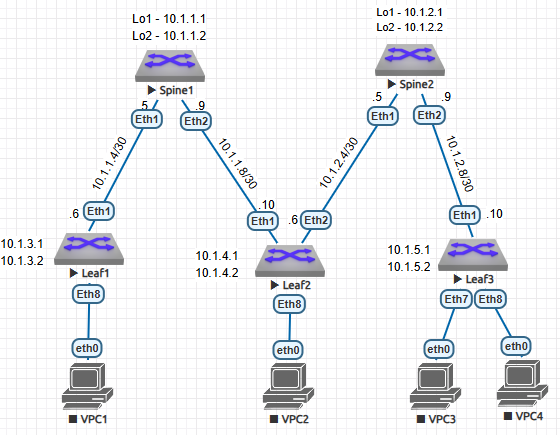

# ДЗ1 Основы проетирования сети
##  Сбор топологии CLOS

## Распределение адресного пространства
##### Адресное пространство будет распределяться по формуле:
ip = 10.st.splf.x, где:
* st - номер ЦОДа
* sp - номер Spine/Leaf
* x - по порядку
* 0 - reserved
* 1 - loopback1
* 2 - loopback2
* 3 - reserved
* 4 - 7 - ptp1
* 8 - 11 - ptp2
* 12 - 15 - reserved
* 16 - 31 - hosts network
## L3 Схема сети

## Конфигурация устройств

1. Spine1:  

interface Loopback1  
description Loopback1  
ip address 10.1.1.1/32

interface Loopback2  
description Loobpack2  
ip address 10.1.1.2/32  

interface Ethernet1  
   description P2P_Leaf1_Eth1  
   no switchport  
   ip address 10.1.1.5/30  

interface Ethernet2  
   description P2P_Leaf2_Eth1  
   no switchport  
   ip address 10.1.1.9/30

2. Leaf1:  

interface Loopback1  
   description Loopback1  
   ip address 10.1.3.1/32  

interface Loopback2  
   description Loopback2  
   ip address 10.1.3.2/32  

   interface Ethernet1  
   description P2P_Spine1_Eth1  
   no switchport  
   ip address 10.1.1.6/30  

   3. Leaf2:  

   interface Loopback1  
   description Loopback1  
   ip address 10.1.4.1/32  

interface Loopback2  
   description Loopback2  
   ip address 10.1.4.2/32  

   interface Ethernet1  
   description P2P_Spine1_Eth2  
   no switchport  
   ip address 10.1.1.10/30  

interface Ethernet2  
   description P2P_Spine2_ETh1  
   no switchport  
   ip address 10.1.2.6/30  

   4. Spine2:  
   
   interface Loopback1  
   description Loopback1  
   ip address 10.1.2.1/32  

interface Loopback2  
   description Loopback2  
   ip address 10.1.2.2/32  

   interface Ethernet1  
   description P2P_Leaf2_Eth2  
   no switchport  
   ip address 10.1.2.5/30  

interface Ethernet2  
   description P2P_Leaf3_Eth1  
   no switchport  
   ip address 10.1.2.9/30  

   5. Leaf3:

   interface Loopback1  
   description Loopback1  
   ip address 10.1.5.1/32  

interface Loopback2  
   description Loopback2  
   ip address 10.1.5.2/32  

   interface Ethernet1  
   description P2P_Spine2_Eth2  
   no switchport  
   ip address 10.1.2.10/30  
