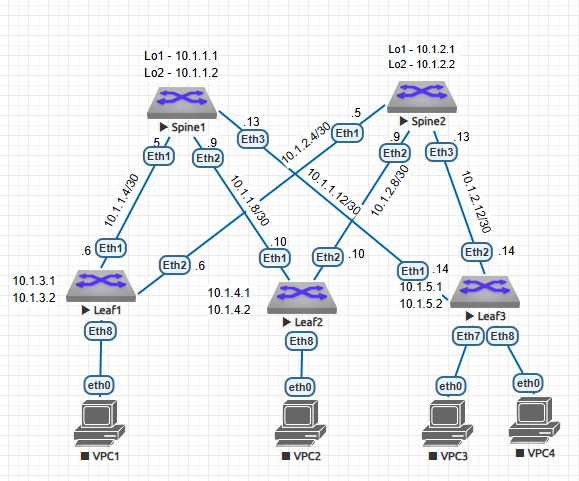

# ДЗ1 Основы проетирования сети
##  Сбор топологии CLOS + L3 Схема сети

## Распределение адресного пространства
##### Адресное пространство будет распределяться по формуле:
ip = 10.st.splf.x, где:
* st - номер ЦОДа
* sp - номер Spine/Leaf
* x - по порядку
* 0 - reserved
* 1 - loopback1
* 2 - loopback2
* 3 - reserved
* 4 - 7 - ptp1
* 8 - 11 - ptp2
* 12 - 15 - ptp3
* 16 - 31 - hosts network  

таблица адресов  
| network ipv4 | Device/port|    Description    |
|--------------|:----------:| -----------------:|
| 10.1.1.1/32  | Spine1/lo1 |     Loopback1     |
| 10.1.1.2/32  | Spine1/lo2 |     Loopback2     |
| 10.1.2.1/32  | Spine2/lo1 |     Loopback1     |
| 10.1.2.2/32  | Spine2/lo2 |     Loopback2     |
| 10.1.3.1/32  |  Leaf1/lo1 |     Loopback1     |
| 10.1.3.2/32  |  Leaf1/lo2 |     Loopback2     |
| 10.1.4.1/32  |  Leaf2/lo1 |     Loopback1     |
| 10.1.4.2/32  |  Leaf2/lo2 |     Loopback2     |
| 10.1.5.1/32  |  Leaf3/lo1 |     Loopback1     |
| 10.1.5.2/32  |  Leaf3/lo2 |     Loopback2     |
| 10.1.1.5/30  | Spine1/Eth1| P2P Link To Leaf1 |
| 10.1.1.9/30  | Spine1/Eth2| P2P Link To Leaf2 |
| 10.1.1.13/30 | Spine1/Eth3| P2P Link To Leaf3 |
| 10.1.1.6/30  | Leaf1/Eth1 | P2P Link To Spine1|
| 10.1.2.6/30  | Leaf1/Eth2 | P2P Link To Spine2|
| 10.1.2.5/30  | Spine2/Eth1| P2P Link To Leaf1 |
| 10.1.2.9/30  | Spine2/Eth2| P2P Link To Leaf2 |
| 10.1.2.13/30 | Spine2/Eth2| P2P Link To Leaf3 |
| 10.1.1.10/30 | Leaf2/Eth1 | P2P Link To Spine1|
| 10.1.2.10/30 | Leaf2/Eth2 | P2P Link To Spine2|
| 10.1.1.14/30 | Leaf3/Eth1 | P2P Link To Spine1|
| 10.1.2.14/30 | Leaf3/Eth2 | P2P Link To Spine2|

## Конфигурация устройств

1. Spine1:   

```console
!
interface Loopback1  
   description Loopback1  
   ip address 10.1.1.1/32
!
interface Loopback2  
   description Loobpack2  
   ip address 10.1.1.2/32  
!
interface Ethernet1
   description P2P_Leaf1_Eth1
   no switchport
   ip address 10.1.1.5/30
!
interface Ethernet2
   description P2P_Leaf2_Eth1
   no switchport
   ip address 10.1.1.9/30
!
interface Ethernet3
   description P2P_Leaf3_Eth1
   no switchport
   ip address 10.1.1.13/30
```

2. Leaf1:  

```console
!
interface Loopback1  
   description Loopback1  
   ip address 10.1.3.1/32  
!
interface Loopback2  
   description Loopback2  
   ip address 10.1.3.2/32 
!
interface Ethernet1
   description P2P_Spine1_Eth1
   no switchport
   ip address 10.1.1.6/30
!
interface Ethernet2
   description P2P_Spine2_Eth1
   no switchport
   ip address 10.1.2.6/30 
```

   3. Leaf2:  

```console
!
interface Loopback1  
   description Loopback1  
   ip address 10.1.4.1/32  
!
interface Loopback2  
   description Loopback2  
   ip address 10.1.4.2/32  
!
interface Ethernet1
   description P2P_Spine1_Eth2
   no switchport
   ip address 10.1.1.10/30
!
interface Ethernet2
   description P2P_Spine2_ETh2
   no switchport
   ip address 10.1.2.10/30
```

4. Spine2:  
```console
!
interface Loopback1  
   description Loopback1  
   ip address 10.1.2.1/32  
!
interface Loopback2  
   description Loopback2  
   ip address 10.1.2.2/32  
!
interface Ethernet1
   description P2P_Leaf1_Eth2
   no switchport
   ip address 10.1.2.5/30
!
interface Ethernet2
   description P2P_Leaf2_Eth2
   no switchport
   ip address 10.1.2.9/30
!
interface Ethernet3
   description P2P_Leaf3_Eth2
   no switchport
   ip address 10.1.2.13/30
```

   5. Leaf3:

  ```console
!
interface Loopback1  
   description Loopback1  
   ip address 10.1.5.1/32  
!
interface Loopback2  
   description Loopback2  
   ip address 10.1.5.2/32  
!
interface Ethernet1
   description P2P_Spine1_Eth3
   no switchport
   ip address 10.1.1.14/30
!
interface Ethernet2
   description P2P_Spine2_Eth3
   no switchport
   ip address 10.1.2.14/30
  ```