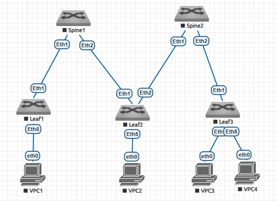

## Дз2 Построение Underlay сети(OSPF)
### План работ:
1. Добавить L3 схему сети
2. Добавить таблицу с ip пространством
3. Включить на всех устройствах ip routing
4. Включить на всех устройствах процесс OSPF
5. Настроить на всех устройствах Douter id
6. Добавить все интерфейсы и лупбеки в OSPF
7. Проверить таблицу маршрутизации и пингануть устройства
8. Настроить ауктентификацию OSPF
9. Настроить работу протокола BFD

### 1. L3 схема сети


### 2. Таблица с ip пространством
| network ipv4 | Device/port|    Description    |
|--------------|:----------:| -----------------:|
| 10.1.1.1/32  | Spine1/lo1 |     Loopback1     |
| 10.1.1.2/32  | Spine1/lo2 |     Loopback2     |
| 10.1.2.1/32  | Spine2/lo1 |     Loopback1     |
| 10.1.2.2/32  | Spine2/lo2 |     Loopback2     |
| 10.1.3.1/32  |  Leaf1/lo1 |     Loopback1     |
| 10.1.3.2/32  |  Leaf1/lo2 |     Loopback2     |
| 10.1.4.1/32  |  Leaf2/lo1 |     Loopback1     |
| 10.1.4.2/32  |  Leaf2/lo2 |     Loopback2     |
| 10.1.5.1/32  |  Leaf3/lo1 |     Loopback1     |
| 10.1.5.2/32  |  Leaf3/lo2 |     Loopback2     |
| 10.1.1.5/30  | Spine1/Eth1| P2P Link To Leaf1 |
| 10.1.1.9/30  | Spine1/Eth2| P2P Link To Leaf2 |
| 10.1.1.13/30 | Spine1/Eth3| P2P Link To Leaf3 |
| 10.1.1.6/30  | Leaf1/Eth1 | P2P Link To Spine1|
| 10.1.2.6/30  | Leaf1/Eth2 | P2P Link To Spine2|
| 10.1.2.5/30  | Spine2/Eth1| P2P Link To Leaf1 |
| 10.1.2.9/30  | Spine2/Eth2| P2P Link To Leaf2 |
| 10.1.2.13/30 | Spine2/Eth2| P2P Link To Leaf3 |
| 10.1.1.10/30 | Leaf2/Eth1 | P2P Link To Spine1|
| 10.1.2.10/30 | Leaf2/Eth2 | P2P Link To Spine2|
| 10.1.1.14/30 | Leaf3/Eth1 | P2P Link To Spine1|
| 10.1.2.14/30 | Leaf3/Eth2 | P2P Link To Spine2|

### 3. включение ip routing на всех устройствах

```console
Spine1#conf t
Spine1(config)#ip routing

Spine2#conf t
Spine2(config)#ip routing

Leaf1#conf t
Leaf1(config)#ip routing

Leaf2#conf t
Leaf2(config)#ip routing

Leaf3#conf t
Leaf3(config)#ip routing
```

### 4. Включить на всех устройствах процесс OPSF

```console
Spine1#conf t
Spine1(config)#router ospf 99

Spine2#conf t
Spine2(config)#router ospf 99

Leaf1#conf t
Leaf1(config)#router ospf 99

Leaf2#conf t
Leaf2(config)#router ospf 99

Leaf3#conf t
Leaf3(config)#router ospf 99
```

### 5. Настроить на всех устройствах Douter id

```console
Spine1#conf t
Spine1(config)#router ospf 99
Spine1(config-router-ospf)#router-id 10.1.1.1

Spine2#conf t
Spine2(config)#router ospf 99
Spine2(config-router-ospf)#router-id 10.1.2.1

Leaf1#conf t
Leaf1(config)#router ospf 99
Leaf2(config-router-ospf)#router-id 10.1.3.1

Leaf2#conf t
Leaf2(config)#router ospf 99
Leaf2(config-router-ospf)#router-id 10.1.4.1

Leaf3#conf t
Leaf3(config)#router ospf 99
Leaf3(config-router-ospf)#router-id 10.1.5.1
```

### 6. Добавить все интерфейсы и лупбеки в OSPF

```console
Spine1#conf t
Spine1(config)#int loopback 1
Spine1(config-if-Lo1)#ip ospf area 0.0.0.0
Spine1(config)#int loopback 2
Spine1(config-if-Lo2)#ip ospf area 0.0.0.0
Spine1(config)#int ethernet 1
Spine1(config-if-Et1)#ip ospf network point-to-point
Spine1(config-if-Et1)#ip ospf area 0.0.0.0
Spine1(config)#int ethernet 2
Spine1(config-if-Et2)#ip ospf network point-to-point
Spine1(config-if-Et2)#ip ospf area 0.0.0.0
Spine1(config)#int ethernet 3
Spine1(config-if-Et3)#ip ospf network point-to-point
Spine1(config-if-Et3)#ip ospf area 0.0.0.0

Spine2#conf t
Spine2(config)#int loopback 1
Spine2(config-if-Lo1)#ip ospf area 0.0.0.0
Spine2(config)#int loopback 2
Spine2(config-if-Lo2)#ip ospf area 0.0.0.0
Spine2(config)#int ethernet 1
Spine2(config-if-Et1)#ip ospf network point-to-point
Spine2(config-if-Et1)#ip ospf area 0.0.0.0
Spine2(config)#int ethernet 2
Spine2(config-if-Et2)#ip ospf network point-to-point
Spine2(config-if-Et2)#ip ospf area 0.0.0.0
Spine2(config)#int ethernet 3
Spine2(config-if-Et3)#ip ospf network point-to-point
Spine2(config-if-Et3)#ip ospf area 0.0.0.0

Leaf1#conf t
Leaf1(config)#int loopback 1
Leaf1(config-if-Lo1)#ip ospf area 0.0.0.0
Leaf1(config)#int loopback 2
Leaf1(config-if-Lo2)#ip ospf area 0.0.0.0
Leaf1(config)#int ethernet 1
Leaf1(config-if-Et1)#ip ospf network point-to-point
Leaf1(config-if-Et1)#ip ospf area 0.0.0.0
Leaf1(config)#int ethernet 2
Leaf1(config-if-Et2)#ip ospf network point-to-point
Leaf1(config-if-Et2)#ip ospf area 0.0.0.0

Leaf2#conf t
Leaf2(config)#int loopback 1
Leaf2(config-if-Lo1)#ip ospf area 0.0.0.0
Leaf2(config)#int loopback 2
Leaf2(config-if-Lo2)#ip ospf area 0.0.0.0
Leaf2(config)#int ethernet 1
Leaf2(config-if-Et1)#ip ospf network point-to-point
Leaf2(config-if-Et1)#ip ospf area 0.0.0.0
Leaf2(config)#int ethernet 2
Leaf2(config-if-Et2)#ip ospf network point-to-point
Leaf2(config-if-Et2)#ip ospf area 0.0.0.0

Leaf3#conf t
Leaf3(config)#int loopback 1
Leaf3(config-if-Lo1)#ip ospf area 0.0.0.0
Leaf3(config)#int loopback 2
Leaf3(config-if-Lo2)#ip ospf area 0.0.0.0
Leaf3(config)#int ethernet 1
Leaf3(config-if-Et1)#ip ospf network point-to-point
Leaf3(config-if-Et1)#ip ospf area 0.0.0.0
Leaf3(config)#int ethernet 2
Leaf3(config-if-Et2)#ip ospf network point-to-point
Leaf3(config-if-Et2)#ip ospf area 0.0.0.0
```

### 7. Проверить ip связанность лупбеков (для компактности представлено на одном устройстве)

```console
Spine1#ping 10.1.2.1 repeat 1
PING 10.1.2.1 (10.1.2.1) 72(100) bytes of data.
80 bytes from 10.1.2.1: icmp_seq=1 ttl=63 time=24.0 ms
Spine1#ping 10.1.3.1 repeat 1 
PING 10.1.3.1 (10.1.3.1) 72(100) bytes of data.
80 bytes from 10.1.3.1: icmp_seq=1 ttl=64 time=12.6 ms
Spine1#ping 10.1.4.1 repeat 1 
PING 10.1.4.1 (10.1.4.1) 72(100) bytes of data.
80 bytes from 10.1.4.1: icmp_seq=1 ttl=64 time=10.5 ms
Spine1#ping 10.1.5.1 repeat 1 
PING 10.1.5.1 (10.1.5.1) 72(100) bytes of data.
80 bytes from 10.1.5.1: icmp_seq=1 ttl=64 time=19.0 ms

Таблица маршрутизации на примере Spine1

Spine1#sh ip route
 C        10.1.1.1/32 is directly connected, Loopback1
 C        10.1.1.2/32 is directly connected, Loopback2
 C        10.1.1.4/30 is directly connected, Ethernet1
 C        10.1.1.8/30 is directly connected, Ethernet2
 C        10.1.1.12/30 is directly connected, Ethernet3
 O        10.1.2.1/32 [110/30] via 10.1.1.6, Ethernet1
                               via 10.1.1.10, Ethernet2
                               via 10.1.1.14, Ethernet3
 O        10.1.2.2/32 [110/30] via 10.1.1.6, Ethernet1
                               via 10.1.1.10, Ethernet2
                               via 10.1.1.14, Ethernet3
 O        10.1.2.4/30 [110/20] via 10.1.1.6, Ethernet1
 O        10.1.2.8/30 [110/20] via 10.1.1.10, Ethernet2
 O        10.1.2.12/30 [110/20] via 10.1.1.14, Ethernet3
 O        10.1.3.1/32 [110/20] via 10.1.1.6, Ethernet1
 O        10.1.3.2/32 [110/20] via 10.1.1.6, Ethernet1
 O        10.1.4.1/32 [110/20] via 10.1.1.10, Ethernet2
 O        10.1.4.2/32 [110/20] via 10.1.1.10, Ethernet2
 O        10.1.5.1/32 [110/20] via 10.1.1.14, Ethernet3
 O        10.1.5.2/32 [110/20] via 10.1.1.14, Ethernet3

LSDB таблица OSPF

Spine1#sh ip ospf database 

            OSPF Router with ID(10.1.1.1) (Instance ID 99) (VRF default)


                 Router Link States (Area 0.0.0.0)

Link ID         ADV Router      Age         Seq#         Checksum Link count
10.1.2.1        10.1.2.1        553         0x80000039   0x5ffe   8
10.1.4.1        10.1.4.1        739         0x80000008   0x6096   6
10.1.3.1        10.1.3.1        450         0x80000009   0x9475   6
10.1.5.1        10.1.5.1        663         0x80000008   0xcf13   6
10.1.1.1        10.1.1.1        535         0x8000000f   0x9ef3   8
```

### 8. Настройка аутентификации OSPF

```console
Spine1#conf t
Spine1(config)#int ethernet 1
Spine1(config-if-Et1)#ip ospf authentication message-digest 
Spine1(config-if-Et1)#ip ospf message-digest-key 1 md5 cisco
Spine1(config)#int ethernet 2
Spine1(config-if-Et2)#ip ospf authentication message-digest 
Spine1(config-if-Et2)#ip ospf message-digest-key 1 md5 cisco
Spine1(config)#int ethernet 3
Spine1(config-if-Et3)#ip ospf authentication message-digest 
Spine1(config-if-Et3)#ip ospf message-digest-key 1 md5 cisco

Spine2#conf t
Spine2(config)#int ethernet 1
Spine2(config-if-Et1)#ip ospf authentication message-digest 
Spine2(config-if-Et1)#ip ospf message-digest-key 1 md5 cisco
Spine2(config)#int ethernet 2
Spine2(config-if-Et2)#ip ospf authentication message-digest 
Spine2(config-if-Et2)#ip ospf message-digest-key 1 md5 cisco
Spine2(config)#int ethernet 3
Spine2(config-if-Et3)#ip ospf authentication message-digest 
Spine2(config-if-Et3)#ip ospf message-digest-key 1 md5 cisco

Leaf1#conf t
Leaf1(config)#int ethernet 1
Leaf1(config-if-Et1)#ip ospf authentication message-digest 
Leaf1(config-if-Et1)#ip ospf message-digest-key 1 md5 cisco
Leaf1(config)#int ethernet 2
Leaf1(config-if-Et2)#ip ospf authentication message-digest 
Leaf1(config-if-Et2)#ip ospf message-digest-key 1 md5 cisco

Leaf2#conf t
Leaf2(config)#int ethernet 1
Leaf2(config-if-Et1)#ip ospf authentication message-digest 
Leaf2(config-if-Et1)#ip ospf message-digest-key 1 md5 cisco
Leaf2(config)#int ethernet 2
Leaf2(config-if-Et2)#ip ospf authentication message-digest 
Leaf2(config-if-Et2)#ip ospf message-digest-key 1 md5 cisco

Leaf3#conf t
Leaf3(config)#int ethernet 1
Leaf3(config-if-Et1)#ip ospf authentication message-digest 
Leaf3(config-if-Et1)#ip ospf message-digest-key 1 md5 cisco
Leaf3(config)#int ethernet 2
Leaf3(config-if-Et2)#ip ospf authentication message-digest 
Leaf3(config-if-Et2)#ip ospf message-digest-key 1 md5 cisco
```
После настройки видим что соседство OSPF установлено и маршруты идут как полагается

```console
Spine1#sh ip ospf nei
Neighbor ID     Instance VRF      Pri State                  Dead Time   Address         Interface
10.1.3.1        99       default  0   FULL                   00:00:31    10.1.1.6        Ethernet1
10.1.4.1        99       default  0   FULL                   00:00:36    10.1.1.10       Ethernet2
10.1.5.1        99       default  0   FULL                   00:00:31    10.1.1.14       Ethernet3
```
```console
Spine1#sh ip route

 C        10.1.1.1/32 is directly connected, Loopback1
 C        10.1.1.2/32 is directly connected, Loopback2
 C        10.1.1.4/30 is directly connected, Ethernet1
 C        10.1.1.8/30 is directly connected, Ethernet2
 C        10.1.1.12/30 is directly connected, Ethernet3
 O        10.1.2.1/32 [110/30] via 10.1.1.6, Ethernet1
                               via 10.1.1.10, Ethernet2
                               via 10.1.1.14, Ethernet3
 O        10.1.2.2/32 [110/30] via 10.1.1.6, Ethernet1
                               via 10.1.1.10, Ethernet2
                               via 10.1.1.14, Ethernet3
 O        10.1.2.4/30 [110/20] via 10.1.1.6, Ethernet1
 O        10.1.2.8/30 [110/20] via 10.1.1.10, Ethernet2
 O        10.1.2.12/30 [110/20] via 10.1.1.14, Ethernet3
 O        10.1.3.1/32 [110/20] via 10.1.1.6, Ethernet1
 O        10.1.3.2/32 [110/20] via 10.1.1.6, Ethernet1
 O        10.1.4.1/32 [110/20] via 10.1.1.10, Ethernet2
 O        10.1.4.2/32 [110/20] via 10.1.1.10, Ethernet2
 O        10.1.5.1/32 [110/20] via 10.1.1.14, Ethernet3
```
### 9. Настроить работу протокола BFD
BFD настраиваем на физичесикх линках. В целях экономии места покажу на связке Spine1-Leaf1

```console
Spine1#conf t
Spine1(config)#int ethernet 1
Spine1(config-if-Et1)#bfd interval 100 min-rx 100 multiplier 3
Spine1(config-if-Et1)#ip ospf neighbor bfd 

Leaf1#conf t
Leaf1(config)#int ethernet 1
Leaf1(config-if-Et1)#bfd interval 100 min-rx 100 multiplier 3
Leaf1(config-if-Et1)#ip ospf neighbor bfd 
```

Проверка работы BFD:

```console
Spine1#sh bfd peers 
VRF name: default
-----------------
DstAddr       MyDisc    YourDisc  Interface/Transport    Type           LastUp 
--------- ----------- ----------- -------------------- ------- ----------------
10.1.1.6  3861721783  2100275814        Ethernet1(30)  normal   11/20/24 12:21 

   LastDown            LastDiag    State
-------------- ------------------- -----
         NA       No Diagnostic       Up

Leaf1#sh bfd peers 
VRF name: default
-----------------
DstAddr       MyDisc    YourDisc  Interface/Transport    Type           LastUp 
--------- ----------- ----------- -------------------- ------- ----------------
10.1.1.5  2100275814  3861721783        Ethernet1(30)  normal   11/20/24 12:21 

   LastDown            LastDiag    State
-------------- ------------------- -----
         NA       No Diagnostic       Up
```

