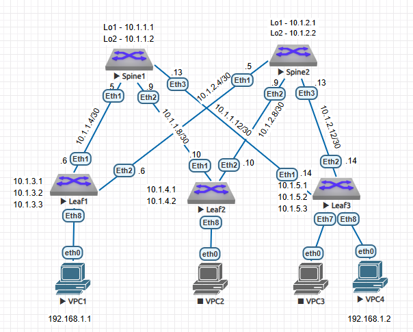

## Дз5 Построение Vxlan EVPN для L2
### План работ:
1. Добавить L3 схему сети
2. Выделить IP адреса для ПК из одной сети на разных Leaf (1 и 3)
3. Настройка VTEP на Leaf 1 и 3
4. Настроить Vlan 100 на Leaf 1 и 3 и прокинуть их аксес портами до соответствующих ПК
5. Привязать VNI к Vlan
6. Поднять Vxlan туннель между Leaf 1 и 3
7. Проверить работоспособность Vxlan
### 1. L3 схема сети


### 2. Выделить IP адреса для ПК из одной сети на разных Leaf (1 и 3)
```console
PC1> ip 192.168.1.1 255.255.255.0 192.168.1.254

PC1> show ip

NAME        : PC1[1]
IP/MASK     : 192.168.1.1/24
GATEWAY     : 192.168.1.254
DNS         : 
MAC         : 00:50:79:66:68:06
LPORT       : 20000
RHOST:PORT  : 127.0.0.1:30000
MTU         : 1500

PC2> ip 192.168.1.2 255.255.255.0 192.168.1.254

PC2> sh ip

NAME        : PC2[1]
IP/MASK     : 192.168.1.2/24
GATEWAY     : 192.168.1.254
DNS         : 
MAC         : 00:50:79:66:68:09
LPORT       : 20000
RHOST:PORT  : 127.0.0.1:30000
MTU         : 1500
```

### 3. Настройка VTEP на Leaf 1 и 3
Выделим отдельный лупбэк для лифа 1 и 3 для интерфейса Vxlan
```console
Leaf1(config)#int loopback 3
Leaf1(config-if-Lo3)#ip address 10.1.3.3 255.255.255.255

Leaf3(config)#int loopback 3
Leaf3(config-if-Lo3)#ip address 10.1.5.3 255.255.255.255
```
Настроим VTEP на Leaf 1 и Leaf 3 и прикрутим к ним lo3
```console
Leaf1#conf t
Leaf1(config)#int vxlan 1
Leaf1(config-if-Vx1)#vxlan source-interface loopback 3
Leaf1(config-if-Vx1)#show active 
interface Vxlan1
   vxlan source-interface Loopback3
   vxlan udp-port 4789

Leaf3(config)#int vxlan 1
Leaf3(config-if-Vx1)#vxlan source-interface loopback 3
Leaf3(config-if-Vx1)#show active 
interface Vxlan1
   vxlan source-interface Loopback3
   vxlan udp-port 4789
```
### 4. Настроить Vlan 100 на Leaf 1 и 3 и прокинуть их аксес портами до соответствующих ПК
```console
Leaf1(config)#vlan 100
Leaf1(config-vlan-100)#name PC
Leaf1(config)#int ethernet 8
Leaf1(config-if-Et8)#description ==PC==
Leaf1(config-if-Et8)#sw mode access 
Leaf1(config-if-Et8)#sw acc vlan 100

Leaf1#sh run int ethernet 8
interface Ethernet8
   description ==PC==
   switchport access vlan 100

Leaf1#sh int ethernet 8 status
Port       Name   Status       Vlan     Duplex Speed  Type            Flags Encapsulation
Et8        ==PC== connected    100      full   1G     EbraTestPhyPort   

Leaf3(config)#vlan 100
Leaf3(config-vlan-100)#name PC
Leaf3(config)#int eth 8
Leaf3(config-if-Et8)#description ==PC==
Leaf3(config-if-Et8)#sw mode access 
Leaf3(config-if-Et8)#sw acc v 100

Leaf3#sh run int ethernet 8
interface Ethernet8
   description ==PC==
   switchport access vlan 100
   
Leaf3#sh int eth 8 status 
Port       Name   Status       Vlan     Duplex Speed  Type            Flags Encapsulation
Et8        ==PC== connected    100      full   1G     EbraTestPhyPort  
```    

### 5. Привязать VNI к Vlan
Соотношение Vlan-ов к VNI будет по схеме:  
№Vlan - 100№Vlan

```console
Leaf1(config-if-Vx1)#vxlan vlan 100 vni 100100
Leaf1(config-if-Vx1)#show active 
interface Vxlan1
   vxlan source-interface Loopback3
   vxlan udp-port 4789
   vxlan vlan 100 vni 100100

Leaf3(config-if-Vx1)#vxlan vlan 100 vni 100100
Leaf3(config-if-Vx1)#show active 
interface Vxlan1
   vxlan source-interface Loopback3
   vxlan udp-port 4789
   vxlan vlan 100 vni 100100
```
### 6. Поднять Vxlan туннель между Leaf 1 и 3

Для того, чтобы у нас заработал Evpn нам необходимо на каждом устройстве ввести команду service routing protocols model multi-agent (в данном примере на обоих спайнах и на лифах 1 и 3) и перезагрузить устройство

```console
Leaf1(config)#service routing protocols model multi-agent 

Leaf3(config)#service routing protocols model multi-agent

Spine1(config)#service routing protocols model multi-agent 

Spine2(config)#service routing protocols model multi-agent 
```
На Leaf коммутатораз добавим отправку extended community в сторону Spine 1 и 2 и в address family evpn активируем с ними соседства

```console
Leaf1(config)#router bgp 65531
Leaf1(config-router-bgp)#neighbor 10.1.1.1 send-community extended 
Leaf1(config-router-bgp)#neighbor 10.1.2.1 send-community extended 
Leaf1(config-router-bgp)#address-family evpn 
Leaf1(config-router-bgp-af)#neighbor 10.1.1.1 activate
Leaf1(config-router-bgp-af)#neighbor 10.1.2.1 activate

Leaf3(config)#router bgp 65533
Leaf3(config-router-bgp)#neighbor 10.1.1.1 send-community extended 
Leaf3(config-router-bgp)#neighbor 10.1.2.1 send-community extended 
Leaf3(config-router-bgp)#address-family evpn 
Leaf3(config-router-bgp-af)#neighbor 10.1.1.1 activate 
Leaf3(config-router-bgp-af)#neighbor 10.1.2.1 activate 
```

Аналогичным образом настроим на Spine 1 и 2 в сторону Leaf 1 и 3

```console
Spine1(config)#router bgp 65534
Spine1(config-router-bgp)#neighbor 10.1.3.1  send-community extended 
Spine1(config-router-bgp)#neighbor 10.1.5.1  send-community extended 
Spine1(config-router-bgp)#address-family evpn 
Spine1(config-router-bgp-af)#neighbor 10.1.3.1 activate 
Spine1(config-router-bgp-af)#neighbor 10.1.5.1 activate

Spine2(config)#router bgp 65534
Spine2(config-router-bgp)#neighbor 10.1.3.1 send-community 
Spine2(config-router-bgp)#neighbor 10.1.3.1 send-community extended 
Spine2(config-router-bgp)#neighbor 10.1.5.1 send-community extended 
Spine2(config-router-bgp)#address-family evpn 
Spine2(config-router-bgp-af)#neighbor 10.1.3.1 activate
Spine2(config-router-bgp-af)#neighbor 10.1.5.1 activate
```
Теперь необходимо заанонсить в BGP адреса наших лупбеков для NVE интерфейса

```console
Leaf1(config)#router bgp 65531
Leaf1(config-router-bgp)#address-family ipv4
Leaf1(config-router-bgp-af)#network 10.1.3.3/32

Leaf3(config)#router bgp 65533
Leaf3(config-router-bgp)#address-family ipv4
Leaf3(config-router-bgp-af)#network 10.1.5.3/32
```

Проверим соседства BGP EVPN

```console
Leaf1#sh bgp evpn summary 
BGP summary information for VRF default
Router identifier 10.1.3.1, local AS number 65531
Neighbor Status Codes: m - Under maintenance
  Neighbor V AS           MsgRcvd   MsgSent  InQ OutQ  Up/Down State   PfxRcd PfxAcc
  10.1.1.1 4 65534            422       411    0   99 00:16:55 Estab   0      0
  10.1.2.1 4 65534            430       405    0   33 00:14:30 Estab   0      0

Leaf3#sh bgp evpn summary 
BGP summary information for VRF default
Router identifier 10.1.5.1, local AS number 65533
Neighbor Status Codes: m - Under maintenance
  Neighbor V AS           MsgRcvd   MsgSent  InQ OutQ  Up/Down State   PfxRcd PfxAcc
  10.1.1.1 4 65534            467       424    0    0 00:17:07 Estab   0      0
  10.1.2.1 4 65534            455       440    0    0 00:14:43 Estab   0      0

Spine1#sh bgp evpn summary 
BGP summary information for VRF default
Router identifier 10.1.1.1, local AS number 65534
Neighbor Status Codes: m - Under maintenance
  Neighbor V AS           MsgRcvd   MsgSent  InQ OutQ  Up/Down State   PfxRcd PfxAcc
  10.1.3.1 4 65531            380       405    0    0 00:05:22 Estab   0      0
  10.1.5.1 4 65533            379       439    0    0 00:05:14 Estab   0      0

Spine2#sh bgp evpn summary 
BGP summary information for VRF default
Router identifier 10.1.2.1, local AS number 65534
Neighbor Status Codes: m - Under maintenance
  Neighbor V AS           MsgRcvd   MsgSent  InQ OutQ  Up/Down State   PfxRcd PfxAcc
  10.1.3.1 4 65531            415       446    0    0 00:15:25 Estab   0      0
  10.1.5.1 4 65533            447       466    0    0 00:15:18 Estab   0      0
```
Назначим RD и RT и заредестрибьютим изученные маки в Overlay

```console
Leaf1(config)#router bgp 65531
Leaf1(config-router-bgp)#vlan 100
Leaf1(config-macvrf-100)#rd 65531:100100
Leaf1(config-macvrf-100)#route-target both 65531:100100
Leaf1(config-macvrf-100)#redistribute learned 

Leaf3(config)#router bgp 65533
Leaf3(config-router-bgp)#vlan 100
Leaf3(config-macvrf-100)#rd 65533:100100
Leaf3(config-macvrf-100)#route-target both 65531:100100
Leaf3(config-macvrf-100)#redistribute learned 
```
### 7. Проверить работоспособность Vxlan

Проверим что сам интерфей Vxlan работает на Leaf 1
```console
Leaf1#sh int vxlan 1
Vxlan1 is up, line protocol is up (connected)
  Hardware is Vxlan
  Source interface is Loopback3 and is active with 10.1.3.3
  Listening on UDP port 4789
  Replication/Flood Mode is headend with Flood List Source: EVPN
  Remote MAC learning via EVPN
  VNI mapping to VLANs
  Static VLAN to VNI mapping is 
    [100, 100100]    
  Note: All Dynamic VLANs used by VCS are internal VLANs.
        Use 'show vxlan vni' for details.
  Static VRF to VNI mapping is not configured
  Headend replication flood vtep list is:
   100 10.1.5.3       
  Shared Router MAC is 0000.0000.0000
```
Видим что интерфейс поднят и видим что изучение адресов идёт с помощью Evpn.  
Проверим что доступен соседний VTPEP
```console
Leaf1#show vxlan vtep 
Remote VTEPS for Vxlan1:

VTEP           Tunnel Type(s)
-------------- --------------
10.1.5.3       flood         

Total number of remote VTEPS:  1
```
Видим что у нас есть соседний VTEP.  
Проверим какие маки изучил Vxlan на Leaf 1 и 3
```console
Leaf1#sh vxlan address-table
          Vxlan Mac Address Table
----------------------------------------------------------------------

VLAN  Mac Address     Type      Prt  VTEP             Moves   Last Move
----  -----------     ----      ---  ----             -----   ---------
 100  0050.7966.6809  EVPN      Vx1  10.1.5.3         1       0:00:03 ago
Total Remote Mac Addresses for this criterion: 1

Leaf3#sh vxlan address-table 
          Vxlan Mac Address Table
----------------------------------------------------------------------

VLAN  Mac Address     Type      Prt  VTEP             Moves   Last Move
----  -----------     ----      ---  ----             -----   ---------
 100  0050.7966.6806  EVPN      Vx1  10.1.3.3         1       0:00:26 ago
Total Remote Mac Addresses for this criterion: 1
```

И посмотрим на второй тип маршрутов
```console
Leaf1#show bgp evpn route-type mac-ip 
BGP routing table information for VRF default
Router identifier 10.1.3.1, local AS number 65531
Route status codes: * - valid, > - active, S - Stale, E - ECMP head, e - ECMP
                    c - Contributing to ECMP, % - Pending BGP convergence
Origin codes: i - IGP, e - EGP, ? - incomplete
AS Path Attributes: Or-ID - Originator ID, C-LST - Cluster List, LL Nexthop - Link Local Nexthop

          Network                Next Hop              Metric  LocPref Weight  Path
 * >      RD: 65531:100100 mac-ip 0050.7966.6806
                                 -                     -       -       0       i
 * >Ec    RD: 65533:100100 mac-ip 0050.7966.6809
                                 10.1.5.3              -       100     0       65534 65533 i
 *  ec    RD: 65533:100100 mac-ip 0050.7966.6809
                                 10.1.5.3              -       100     0       65534 65533 i
```
Пингаенм ПК3 с ПК1
```console
PC1> ping 192.168.1.2

84 bytes from 192.168.1.2 icmp_seq=1 ttl=64 time=67.684 ms
84 bytes from 192.168.1.2 icmp_seq=2 ttl=64 time=45.357 ms
84 bytes from 192.168.1.2 icmp_seq=3 ttl=64 time=51.141 ms
84 bytes from 192.168.1.2 icmp_seq=4 ttl=64 time=178.212 ms
192.168.1.2 icmp_seq=5 timeout
```