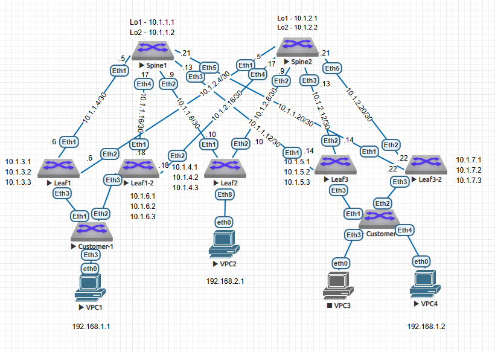

## Дз7 Vxlan_Multihoming
### План работ:
1. Добавить L3 схему сети
2. Добавить таблицу с IP простаранством
3. Добавим 2 новых Leaf коммутатора и настроим underlay
4. Настроим Overlay на новых коммутаторах и поднимим Vxlan
5. Настроим Customer коммутаторы
6. Настроим ESI
7. Проверим отказоустойчивость

### 1. Схема сети


### Таблица с IP пространством
| network ipv4 | Device/port|    Description    |
|--------------|:----------:| -----------------:|
| 10.1.1.1/32  | Spine1/lo1 |     Loopback1     |
| 10.1.1.2/32  | Spine1/lo2 |     Loopback2     |
| 10.1.2.1/32  | Spine2/lo1 |     Loopback1     |
| 10.1.2.2/32  | Spine2/lo2 |     Loopback2     |
| 10.1.3.1/32  |  Leaf1/lo1 |     Loopback1     |
| 10.1.3.2/32  |  Leaf1/lo2 |     Loopback2     |
| 10.1.3.3/32  |  Leaf2/lo3 |     Loopback3     |
| 10.1.4.1/32  |  Leaf2/lo1 |     Loopback1     |
| 10.1.4.2/32  |  Leaf2/lo2 |     Loopback2     |
| 10.1.4.3/32  |  Leaf2/lo3 |     Loopback3     |
| 10.1.5.1/32  |  Leaf3/lo1 |     Loopback1     |
| 10.1.5.2/32  |  Leaf3/lo2 |     Loopback2     |
| 10.1.5.3/32  |  Leaf3/lo3 |     Loopback3     |
| 10.1.6.1/32  |  Leaf1-2/lo1 |     Loopback1     |
| 10.1.6.2/32  |  Leaf1-2/lo2 |     Loopback2     |
| 10.1.6.3/32  |  Leaf1-2/lo3 |     Loopback3     |
| 10.1.7.1/32  |  Leaf3-2/lo1 |     Loopback1     |
| 10.1.7.2/32  |  Leaf3-2/lo2 |     Loopback2     |
| 10.1.7.3/32  |  Leaf3-2/lo3 |     Loopback3     |
| 10.1.1.5/30  | Spine1/Eth1| P2P Link To Leaf1 |
| 10.1.1.9/30  | Spine1/Eth2| P2P Link To Leaf2 |
| 10.1.1.13/30 | Spine1/Eth3| P2P Link To Leaf3 |
| 10.1.1.17/30 | Spine1/Eth4| P2P Link To Leaf1-2 |
| 10.1.1.21/30 | Spine1/Eth5| P2P Link To Leaf3-2 |
| 10.1.1.6/30  | Leaf1/Eth1 | P2P Link To Spine1|
| 10.1.2.6/30  | Leaf1/Eth2 | P2P Link To Spine2|
| 10.1.2.5/30  | Spine2/Eth1| P2P Link To Leaf1 |
| 10.1.2.9/30  | Spine2/Eth2| P2P Link To Leaf2 |
| 10.1.2.13/30 | Spine2/Eth3| P2P Link To Leaf3 |
| 10.1.2.17/30 | Spine2/Eth4| P2P Link To Leaf1-2 |
| 10.1.2.21/30 | Spine2/Eth5| P2P Link To Leaf3-2 |
| 10.1.1.10/30 | Leaf2/Eth1 | P2P Link To Spine1|
| 10.1.2.10/30 | Leaf2/Eth2 | P2P Link To Spine2|
| 10.1.1.14/30 | Leaf3/Eth1 | P2P Link To Spine1|
| 10.1.2.14/30 | Leaf3/Eth2 | P2P Link To Spine2|

### 3. Добавим 2 новых Leaf коммутатора и настроим underlay
Включим ip routin на свичах, настроим лупбеки, OSPF для связанности линков и BGP для связанности всех leaf друг с другом.

```console
Leaf1-2(config)#ip routing 
Leaf1-2(config)#interface loopback 1
Leaf1-2(config-if-Lo1)#ip address 10.1.6.1 255.255.255.255
Leaf1-2(config-if-Lo1)#description Loopback1
Leaf1-2(config-if-Lo1)#int loopback 3
Leaf1-2(config-if-Lo3)#description Vxlan
Leaf1-2(config-if-Lo3)#ip address 10.1.6.3 255.255.255.255
Leaf1-2(config-if-Lo3)#router ospf 99
Leaf1-2(config-router-ospf)#router-id 10.1.6.1
Leaf1-2(config-router-ospf)#passive-interface default 
Leaf1-2(config-router-ospf)#distance ospf intra-area 120
Leaf1-2(config-router-ospf)#interface Loopback1
Leaf1-2(config-if-Lo1)#ip ospf area 0.0.0.0
Leaf1-2(config-if-Lo1)#interface Ethernet1
Leaf1-2(config-if-Et1)#description P2P_Spine1_Eth4
Leaf1-2(config-if-Et1)#no switchport 
Leaf1-2(config-if-Et1)#ip address 10.1.1.18/30
Leaf1-2(config-if-Et1)#bfd interval 100 min-rx 100 multiplier
Leaf1-2(config-if-Et1)#   ip ospf neighbor bfd
Leaf1-2(config-if-Et1)#   ip ospf network point-to-point
Leaf1-2(config-if-Et1)#   ip ospf authentication message-digest
Leaf1-2(config-if-Et1)#   ip ospf area 0.0.0.0
Leaf1-2(config-if-Et1)#ip ospf message-digest-key 1 md5 7 LpyMIOE5MPsSRq6pTPawmA==
Leaf1-2(config-if-Et1)#interface Ethernet2
Leaf1-2(config-if-Et2)#   description P2P_Spine2_Eth4
Leaf1-2(config-if-Et2)# no switchport
Leaf1-2(config-if-Et2)#ip address 10.1.2.18/30 
Leaf1-2(config-if-Et2)#bfd interval 100 min-rx 100 multiplier 3
Leaf1-2(config-if-Et2)#   ip ospf network point-to-point
Leaf1-2(config-if-Et2)#   ip ospf authentication message-digest
Leaf1-2(config-if-Et2)#   ip ospf area 0.0.0.0
Leaf1-2(config-if-Et2)#   ip ospf message-digest-key 1 md5 7 lIjV8sEai21iNsPCdcUksQ==
Leaf1-2(config-if-Et2)#router ospf 99
Leaf1-2(config-router-ospf)#no passive-interface Ethernet1
Leaf1-2(config-router-ospf)#   no passive-interface Ethernet2
Leaf1-2(config-router-ospf)#no passive-interface Loopback1

Leaf3-2(config)#ip routing
Leaf3-2(config)#int loopback 1
Leaf3-2(config-if-Lo1)#description Loopback1
Leaf3-2(config-if-Lo1)#ip address 10.1.7.1 255.255.255.255
Leaf3-2(config-if-Lo1)#int loopback 3
Leaf3-2(config-if-Lo3)#description Vxlan
Leaf3-2(config-if-Lo3)#ip address 10.1.7.3 255.255.255.255
Leaf3-2(config-if-Lo3)#router ospf 99
Leaf3-2(config-router-ospf)#router-id 10.1.7.1
Leaf3-2(config-router-ospf)#passive-interface default 
Leaf3-2(config-router-ospf)#distance ospf intra-area 120
Leaf3-2(config-router-ospf)#interface Loopback1
Leaf3-2(config-if-Lo1)#ip ospf area 0.0.0.0
Leaf3-2(config-if-Lo1)#interface Ethernet1
Leaf3-2(config-if-Et1)#description P2P_Spine1_Eth5
Leaf3-2(config-if-Et1)#no switchport 
Leaf3-2(config-if-Et1)#ip address 10.1.1.22/30
Leaf3-2(config-if-Et1)#bfd interval 100 min-rx 100 multiplier 3
Leaf3-2(config-if-Et1)#   ip ospf network point-to-point
Leaf3-2(config-if-Et1)#   ip ospf authentication message-digest
Leaf3-2(config-if-Et1)#   ip ospf area 0.0.0.0
Leaf3-2(config-if-Et1)#   ip ospf message-digest-key 1 md5 7 LpyMIOE5MPsSRq6pTPawmA==
Leaf3-2(config-if-Et1)#int ethernet 2
Leaf3-2(config-if-Et2)#description P2P_Spine2_Eth5 
Leaf3-2(config-if-Et2)#no switchport 
Leaf3-2(config-if-Et2)#ip address 10.1.2.22/30 
Leaf3-2(config-if-Et2)# bfd interval 100 min-rx 100 multiplier 3
Leaf3-2(config-if-Et2)#   ip ospf network point-to-point
Leaf3-2(config-if-Et2)#   ip ospf authentication message-digest
Leaf3-2(config-if-Et2)#   ip ospf area 0.0.0.0
Leaf3-2(config-if-Et2)#   ip ospf message-digest-key 1 md5 7 lIjV8sEai21iNsPCdcUksQ==
Leaf3-2(config-if-Et2)#router ospf 99
Leaf3-2(config-router-ospf)#no passive-interface Ethernet1
Leaf3-2(config-router-ospf)#   no passive-interface Ethernet2
Leaf3-2(config-router-ospf)#no passive-interface Loopback1

Spine1(config)#interface Ethernet4
Spine1(config-if-Et4)#description P2P_Leaf1-2_Eth1 
Spine1(config-if-Et4)#no switchport 
Spine1(config-if-Et4)#ip address 10.1.1.17/30
Spine1(config-if-Et4)#bfd interval 100 min-rx 100 multiplier 3
Spine1(config-if-Et4)#   ip ospf neighbor bfd
Spine1(config-if-Et4)#   ip ospf network point-to-point
Spine1(config-if-Et4)#   ip ospf authentication message-digest
Spine1(config-if-Et4)#   ip ospf area 0.0.0.0
Spine1(config-if-Et4)#   ip ospf message-digest-key 1 md5 7 lIjV8sEai21iNsPCdcUksQ==
Spine1(config-if-Et4)#interface Ethernet5
Spine1(config-if-Et5)#description P2P_Leaf3-2_Eth1 
Spine1(config-if-Et5)#no switchport 
Spine1(config-if-Et5)#ip address 10.1.1.21/30
Spine1(config-if-Et5)#bfd interval 100 min-rx 100 multiplier 3
Spine1(config-if-Et5)#   ip ospf neighbor bfd
Spine1(config-if-Et5)#   ip ospf network point-to-point
Spine1(config-if-Et5)#   ip ospf authentication message-digest
Spine1(config-if-Et5)#   ip ospf area 0.0.0.0
Spine1(config-if-Et5)#   ip ospf message-digest-key 1 md5 7 lIjV8sEai21iNsPCdcUksQ==
Spine1(config-if-Et5)#router ospf 99
Spine1(config-router-ospf)#no passive-interface Ethernet4
Spine1(config-router-ospf)#no passive-interface Ethernet5
```
Проверим соседство OSPF

```console
Leaf1-2#sh ip ospf neighbor 
Neighbor ID     Instance VRF      Pri State                  Dead Time   Address         Interface
10.1.1.1        99       default  0   FULL                   00:00:35    10.1.1.17       Ethernet1
10.1.2.1        99       default  0   FULL                   00:00:33    10.1.2.17       Ethernet2

Spine1#sh ip ospf neighbor 
Neighbor ID     Instance VRF      Pri State                  Dead Time   Address         Interface
10.1.3.1        99       default  0   FULL                   00:00:35    10.1.1.6        Ethernet1
10.1.4.1        99       default  0   FULL                   00:00:34    10.1.1.10       Ethernet2
10.1.5.1        99       default  0   FULL                   00:00:34    10.1.1.14       Ethernet3
10.1.6.1        99       default  0   FULL                   00:00:38    10.1.1.18       Ethernet4
10.1.7.1        99       default  0   FULL                   00:00:35    10.1.1.22       Ethernet5
```

Настройка BGP

```console
Spine1(config)#router bgp 65534
Spine1(config-router-bgp)#neighbor 10.1.6.1 remote-as 65531
Spine1(config-router-bgp)#neighbor 10.1.6.1 update-source Loopback1
Spine1(config-router-bgp)#neighbor 10.1.6.1 ebgp-multihop
Spine1(config-router-bgp)#neighbor 10.1.7.1 remote-as 65531 
Spine1(config-router-bgp)#neighbor 10.1.7.1 ebgp-multihop 
Spine1(config-router-bgp)#neighbor 10.1.7.1 remote-as 65533
Spine1(config-router-bgp)#neighbor 10.1.7.1 update-source Loopback1
Spine1(config-router-bgp)#address-family ipv4
Spine1(config-router-bgp-af)#neighbor 10.1.6.1 activate         
Spine1(config-router-bgp-af)#neighbor 10.1.7.1 activate 

Spine2(config)#router bgp 65534
Spine2(config-router-bgp)#neighbor 10.1.6.1 remote-as 65531
Spine2(config-router-bgp)#neighbor 10.1.6.1 update-source Loopback1
Spine2(config-router-bgp)#neighbor 10.1.6.1 ebgp-multihop
Spine2(config-router-bgp)#neighbor 10.1.7.1 remote-as 65531 
Spine2(config-router-bgp)#neighbor 10.1.7.1 ebgp-multihop 
Spine2(config-router-bgp)#neighbor 10.1.7.1 remote-as 65533
Spine2(config-router-bgp)#neighbor 10.1.7.1 update-source Loopback1
Spine2(config-router-bgp)#address-family ipv4
Spine2(config-router-bgp-af)#neighbor 10.1.6.1 activate         
Spine2(config-router-bgp-af)#neighbor 10.1.7.1 activate 

Leaf1-2(config)#router bgp 65528
Leaf1-2(config-router-bgp)#router-id 10.1.6.1
Leaf1-2(config-router-bgp)#neighbor 10.1.1.1 remote-as 65534
Leaf1-2(config-router-bgp)#neighbor 10.1.1.1 update-source Loopback1
Leaf1-2(config-router-bgp)#neighbor 10.1.1.1 ebgp-multihop
Leaf1-2(config-router-bgp)#neighbor 10.1.1.1 send-community extended
Leaf1-2(config-router-bgp)#neighbor 10.1.2.1 remote-as 65534
Leaf1-2(config-router-bgp)#neighbor 10.1.2.1 update-source Loopback1
Leaf1-2(config-router-bgp)#neighbor 10.1.2.1 ebgp-multihop
Leaf1-2(config-router-bgp)#neighbor 10.1.2.1 send-community extended
Leaf1-2(config-router-bgp)#address-family ipv4 
Leaf1-2(config-router-bgp-af)#neighbor 10.1.1.1 activate 
Leaf1-2(config-router-bgp-af)#neighbor 10.1.2.1 activate
Leaf1-2(config-router-bgp-af)#network 10.1.6.1/32 

Leaf3-2(config)#router bgp 65529
Leaf3-2(config-router-bgp)#router-id 10.1.7.1
Leaf3-2(config-router-bgp)#neighbor 10.1.1.1 remote-as 65534
Leaf3-2(config-router-bgp)#neighbor 10.1.1.1 update-source Loopback1
Leaf3-2(config-router-bgp)#neighbor 10.1.1.1 ebgp-multihop
Leaf3-2(config-router-bgp)#neighbor 10.1.1.1 send-community extended
Leaf3-2(config-router-bgp)#neighbor 10.1.2.1 remote-as 65534
Leaf3-2(config-router-bgp)#neighbor 10.1.2.1 update-source Loopback1
Leaf3-2(config-router-bgp)#neighbor 10.1.2.1 ebgp-multihop
Leaf3-2(config-router-bgp)#neighbor 10.1.2.1 send-community extended
Leaf3-2(config-router-bgp)#address-family ipv4
Leaf3-2(config-router-bgp-af)#neighbor 10.1.1.1 activate 
Leaf3-2(config-router-bgp-af)#neighbor 10.1.2.1 activate 
Leaf1-2(config-router-bgp-af)#network 10.1.7.1/32
```

Проверим BGP

```console
Leaf3-2#sh ip bgp summary
BGP summary information for VRF default
Router identifier 10.1.7.1, local AS number 65529
Neighbor Status Codes: m - Under maintenance
  Neighbor V AS           MsgRcvd   MsgSent  InQ OutQ  Up/Down State   PfxRcd PfxAcc
  10.1.1.1 4 65534            166       150    0    0 01:00:54 Estab   8      8
  10.1.2.1 4 65534            167       162    0    0 01:00:51 Estab   8      8
```

### 4. Настроим Overlay на новых коммутаторах и поднимим Vxlan

```console
Spine1#conf t
Spine1(config)#router bgp 65534
Spine1(config-router-bgp)#neighbor 10.1.6.1 send-community extended 
Spine1(config-router-bgp)#neighbor 10.1.7.1 send-community extended 

Spine2#conf t
Spine2(config)#router bgp 65534
Spine2(config-router-bgp)#neighbor 10.1.6.1 send-community extended 
Spine2(config-router-bgp)#neighbor 10.1.7.1 send-community extended 

Leaf1-2#conf t
Leaf1-2(config)#service routing protocols model multi-agent

Leaf3-2#conf t
Leaf3-2(config)#service routing protocols model multi-agent

Leaf1-2#conf t
Leaf1-2(config)#vlan 100
Leaf1-2(config-vlan-100)#name PC
Leaf1-2(config-vlan-100)#vrf instance GLOBAL
Leaf1-2(config-vrf-GLOBAL)#interface Vlan100
Leaf1-2(config-if-Vl100)#description ==PC==
Leaf1-2(config-if-Vl100)#vrf GLOBAL
Leaf1-2(config-if-Vl100)#ip address virtual 192.168.1.254/24
Leaf1-2(config-if-Vl100)#interface Vxlan1
Leaf1-2(config-if-Vx1)#vxlan source-interface Loopback3
Leaf1-2(config-if-Vx1)#vxlan udp-port 4789
Leaf1-2(config-if-Vx1)#vxlan vlan 100 vni 100100
Leaf1-2(config-if-Vx1)#vxlan vrf GLOBAL vni 100001
Leaf1-2(config-if-Vx1)#exit
Leaf1-2(config)#ip routing vrf GLOBAL
Leaf1-2(config)#router bgp 65528
Leaf1-2(config-router-bgp)#vlan 100
Leaf1-2(config-macvrf-100)#rd 65528:100100
Leaf1-2(config-macvrf-100)#route-target both 65531:100100
Leaf1-2(config-macvrf-100)#redistribute learned
Leaf1-2(config-macvrf-100)#exit
Leaf1-2(config-router-bgp)# address-family evpn
Leaf1-2(config-router-bgp-af)#neighbor 10.1.1.1 activate
Leaf1-2(config-router-bgp-af)#neighbor 10.1.2.1 activate 
Leaf1-2(config-router-bgp-af)#exit
Leaf1-2(config-router-bgp)# address-family ipv4
Leaf1-2(config-router-bgp-af)#network 10.1.6.3/32 
Leaf1-2(config-router-bgp-af)#exit
Leaf1-2(config-router-bgp)#vrf GLOBAL
Leaf1-2(config-router-bgp-vrf-GLOBAL)#rd 65531:100001
Leaf1-2(config-router-bgp-vrf-GLOBAL)#route-target import evpn 1:100001
Leaf1-2(config-router-bgp-vrf-GLOBAL)#route-target export evpn 1:100001
Leaf1-2(config-router-bgp-vrf-GLOBAL)#redistribute connected
Leaf1-2(config-router-bgp-vrf-GLOBAL)#exit
Leaf1-2(config)#router bgp 65528
Leaf1-2(config-router-bgp)#neighbor 10.1.1.1 send-community extended 
Leaf1-2(config-router-bgp)#neighbor 10.1.2.1 send-community extended 

Leaf3-2(config)#vrf instance GLOBAL
Leaf3-2(config-vrf-GLOBAL)#exit
Leaf3-2(config)#ip routing vrf GLOBAL
Leaf3-2(config)#vlan 100
Leaf3-2(config-vlan-100)#name PC
Leaf3-2(config-vlan-100)#exit
Leaf3-2(config)#interface Vlan100
Leaf3-2(config-if-Vl100)#description ==PC==
Leaf3-2(config-if-Vl100)#vrf GLOBAL
Leaf3-2(config-if-Vl100)#ip address virtual 192.168.1.254/24
Leaf3-2(config-if-Vl100)#interface Vxlan1
Leaf3-2(config-if-Vx1)#vxlan source-interface Loopback3
Leaf3-2(config-if-Vx1)#vxlan udp-port 4789
Leaf3-2(config-if-Vx1)#vxlan vlan 100 vni 100100
Leaf3-2(config-if-Vx1)#vxlan vrf GLOBAL vni 100001
Leaf3-2(config-if-Vx1)#router bgp 65529
Leaf3-2(config-router-bgp)#vlan 100
Leaf3-2(config-macvrf-100)#rd 65529:100100
Leaf3-2(config-macvrf-100)#route-target both 65531:100100
Leaf3-2(config-macvrf-100)#redistribute learned
Leaf3-2(config-macvrf-100)#exit
Leaf3-2(config-router-bgp)#address-family evpn
Leaf3-2(config-router-bgp-af)#neighbor 10.1.1.1 activate
Leaf3-2(config-router-bgp-af)#neighbor 10.1.2.1 activate
Leaf3-2(config-router-bgp-af)#exit
Leaf3-2(config-router-bgp)# address-family ipv4
Leaf3-2(config-router-bgp-af)#network 10.1.7.3/32 
Leaf3-2(config-router-bgp-af)#exit
Leaf3-2(config-router-bgp)#vrf GLOBAL
Leaf3-2(config-router-bgp-vrf-GLOBAL)#rd 65533:100001
Leaf3-2(config-router-bgp-vrf-GLOBAL)#route-target import evpn 1:100001
Leaf3-2(config-router-bgp-vrf-GLOBAL)#route-target export evpn 1:100001
Leaf3-2(config-router-bgp-vrf-GLOBAL)#redistribute connected
Leaf3-2(config)#router bgp 65533
Leaf3-2(config-router-bgp)#neighbor 10.1.1.1 send-community extended 
Leaf3-2(config-router-bgp)#neighbor 10.1.2.1 send-community extended 

Spine1(config)#router bgp 65534
Spine1(config-router-bgp)#address-family evpn
Spine1(config-router-bgp-af)#neighbor 10.1.6.1 activate 
Spine1(config-router-bgp-af)#neighbor 10.1.7.1 activate 

Spine2(config)#router bgp 65534
Spine2(config-router-bgp)#address-family evpn
Spine2(config-router-bgp-af)#neighbor 10.1.6.1 activate 
Spine2(config-router-bgp-af)#neighbor 10.1.7.1 activate 
```

Проверим что vxlan поднялся

```console
Leaf1#sh vxlan vtep 
Remote VTEPS for Vxlan1:

VTEP           Tunnel Type(s)
-------------- --------------
10.1.4.3       unicast       
10.1.5.3       flood, unicast
10.1.6.3       flood, unicast
10.1.7.3       flood, unicast

Leaf1-2#sh vxlan vtep 
Remote VTEPS for Vxlan1:

VTEP           Tunnel Type(s)
-------------- --------------
10.1.3.3       unicast, flood
10.1.4.3       unicast       
10.1.5.3       unicast, flood
10.1.7.3       flood     
```

### 5. Настроим Customer коммутаторы

Настроим порт ченнелы на лифах в сторону customer

```console
Leaf1#conf t
Leaf1(config)#int ethernet 3
Leaf1(config-if-Et3)#channel-group 1 mode active 
Leaf1(config-if-Et3)#int po 1
Leaf1(config-if-Po1)#switchport 
Leaf1(config-if-Po1)#sw mode trunk 
Leaf1(config-if-Po1)#sw tru allowed v 100

Leaf1-2#conf t
Leaf1-2(config)#int ethernet 3
Leaf1-2(config-if-Et3)#channel-group 1 mode active 
Leaf1-2(config-if-Et3)#int po 1
Leaf1-2(config-if-Po1)#sw
Leaf1-2(config-if-Po1)#sw mode trunk 
Leaf1-2(config-if-Po1)#sw trunk allowed v 100

Leaf3(config)#int ethernet 3
Leaf3(config-if-Et3)#channel-group 1 mode active 
Leaf3(config-if-Et3)#int po 1
Leaf3(config-if-Po1)#sw
Leaf3(config-if-Po1)#sw mode trunk 
Leaf3(config-if-Po1)#sw trunk allowed v 100

Leaf3-2#conf t
Leaf3-2(config)#int ethernet 3
Leaf3-2(config-if-Et3)#channel-group 1  mode active 
Leaf3-2(config-if-Et3)#int po 1
Leaf3-2(config-if-Po1)#sw
Leaf3-2(config-if-Po1)#sw mode trunk
Leaf3-2(config-if-Po1)#sw trunk allowed v 100
```

Настроим customer коммутаторы, порт ченнелы на них и аксес порт в сторону пк

```console
CUSTOMER-1(config)#int ethernet 1-2
CUSTOMER-1(config-if-Et1-2)#channel-group 1 mode active 
CUSTOMER-1(config-if-Et1-2)#int po 1
CUSTOMER-1(config-if-Po1)#sw
CUSTOMER-1(config-if-Po1)#sw mode trunk
CUSTOMER-1(config-if-Po1)#sw trunk all v 100
CUSTOMER-1(config-if-Po1)#exit
CUSTOMER-1(config)#vlan 100
CUSTOMER-1(config-vlan-100)#name PC
CUSTOMER-1(config-vlan-100)#exit
CUSTOMER-1(config)#int eth3
CUSTOMER-1(config-if-Et3)#sw
CUSTOMER-1(config-if-Et3)#sw mode acc
CUSTOMER-1(config-if-Et3)#sw acc v 100

CUSTOMER-2(config)#int ethernet 1-2
CUSTOMER-2(config-if-Et1-2)#channel-group 1 mode active 
CUSTOMER-2(config-if-Et1-2)#int po1
CUSTOMER-2(config-if-Po1)#sw 
CUSTOMER-2(config-if-Po1)#sw mode trunk
CUSTOMER-2(config-if-Po1)#sw trunk allowed v 100
CUSTOMER-2(config)#vlan 100
CUSTOMER-2(config-vlan-100)#name PC
CUSTOMER-2(config-vlan-100)#exit
CUSTOMER-2(config)#int eth3
CUSTOMER-2(config-if-Et3)#sw
CUSTOMER-2(config-if-Et3)#sw mode acc
CUSTOMER-2(config-if-Et3)#sw acc v  100
CUSTOMER-2(config)#int ethernet 4
CUSTOMER-2(config-if-Et4)#sw
CUSTOMER-2(config-if-Et4)#sw mode acc
CUSTOMER-2(config-if-Et4)#sw acc v 100
```

Проверим порт ченнел без ESI

```console
CUSTOMER-2#sh port-channel dense 

                 Flags                                                         
------------------------ ---------------------------- -------------------------
  a - LACP Active          p - LACP Passive           * - static fallback      
  F - Fallback enabled     f - Fallback configured    ^ - individual fallback  
  U - In Use               D - Down                                            
  + - In-Sync              - - Out-of-Sync            i - incompatible with agg
  P - bundled in Po        s - suspended              G - Aggregable           
  I - Individual           S - ShortTimeout           w - wait for agg         
  E - Inactive. The number of configured port channels exceeds the config limit
   M - Exceeds maximum weight

Number of channels in use: 1
Number of aggregators: 2

   Port-Channel       Protocol    Ports             
------------------ -------------- ------------------
   Po1(U)             LACP(a)     Et1(PG+) Et2(iG-)
```

### 6. Настроим ESI

Параметры ESI настроим ссылаясь на мак адреса порт ченнелов customer коммутаторов

```console
CUSTOMER-1#sh int po1
Port-Channel1 is up, line protocol is up (connected)
  Hardware is Port-Channel, address is 5000.000d.0001
```

Мак - 5000.000d.0001  
identifier 0050:0000:0000:000d:0001  
route-target import 50:00:00:0d:00:01  
lacp system-id 5000.000d.0001

```console
Leaf1(config)#interface Port-Channel1
Leaf1(config-if-Po1)#evpn ethernet-segment
Leaf1(config-evpn-es)#identifier 0050:0000:0000:000d:0001
Leaf1(config-evpn-es)#route-target import 50:00:00:0d:00:01
Leaf1(config-evpn-es)#lacp system-id 5000.000d.0001

Leaf1-2(config)#interface Port-Channel1
Leaf1-2(config-if-Po1)#evpn ethernet-segment
Leaf1-2(config-evpn-es)#identifier 0050:0000:0000:000d:0001
Leaf1-2(config-evpn-es)#route-target import 50:00:00:0d:00:01
Leaf1-2(config-evpn-es)#lacp system-id 5000.000d.0001

Leaf3(config)#interface Port-Channel1
Leaf3(config-if-Po1)#evpn ethernet-segment
Leaf3(config-evpn-es)#identifier 0050:0000:0000:000c:0001
Leaf3(config-evpn-es)#route-target import 50:00:00:0c:00:01
Leaf3(config-evpn-es)#lacp system-id 5000.000c.0001

Leaf3-2(config)#interface Port-Channel1
Leaf3-2(config-if-Po1)#evpn ethernet-segment
Leaf3-2(config-evpn-es)#identifier 0050:0000:0000:000c:0001
Leaf3-2(config-evpn-es)#route-target import 50:00:00:0c:00:01
Leaf3-2(config-evpn-es)#lacp system-id 5000.000c.0001
```

Убедимся что собрали правильно

```console
CUSTOMER-1#sh port-channel dense 

                 Flags                                                         
------------------------ ---------------------------- -------------------------
  a - LACP Active          p - LACP Passive           * - static fallback      
  F - Fallback enabled     f - Fallback configured    ^ - individual fallback  
  U - In Use               D - Down                                            
  + - In-Sync              - - Out-of-Sync            i - incompatible with agg
  P - bundled in Po        s - suspended              G - Aggregable           
  I - Individual           S - ShortTimeout           w - wait for agg         
  E - Inactive. The number of configured port channels exceeds the config limit
   M - Exceeds maximum weight

Number of channels in use: 1
Number of aggregators: 1

   Port-Channel       Protocol    Ports             
------------------ -------------- ------------------
   Po1(U)             LACP(a)     Et1(PG+) Et2(PG+) 
```

### 7. Проверим отказоустойчивость
Сломаем один из порт ченнелов на одном из лифов и проверим работоспособность

```console
Leaf3(config)#int po1
Leaf3(config-if-Po1)#shut

PC2> ping 192.168.1.1 -t

84 bytes from 192.168.1.1 icmp_seq=1 ttl=64 time=442.926 ms
84 bytes from 192.168.1.1 icmp_seq=2 ttl=64 time=188.885 ms
84 bytes from 192.168.1.1 icmp_seq=3 ttl=64 time=251.949 ms
84 bytes from 192.168.1.1 icmp_seq=4 ttl=64 time=104.317 ms
84 bytes from 192.168.1.1 icmp_seq=5 ttl=64 time=216.921 ms
84 bytes from 192.168.1.1 icmp_seq=6 ttl=64 time=196.690 ms
84 bytes from 192.168.1.1 icmp_seq=7 ttl=64 time=102.936 ms
84 bytes from 192.168.1.1 icmp_seq=8 ttl=64 time=119.433 ms
84 bytes from 192.168.1.1 icmp_seq=9 ttl=64 time=99.106 ms
84 bytes from 192.168.1.1 icmp_seq=10 ttl=64 time=84.652 ms
84 bytes from 192.168.1.1 icmp_seq=11 ttl=64 time=112.852 ms
84 bytes from 192.168.1.1 icmp_seq=12 ttl=64 time=116.234 ms
84 bytes from 192.168.1.1 icmp_seq=13 ttl=64 time=180.851 ms
192.168.1.1 icmp_seq=14 timeout
84 bytes from 192.168.1.1 icmp_seq=15 ttl=64 time=128.663 ms
84 bytes from 192.168.1.1 icmp_seq=16 ttl=64 time=166.458 ms
```

Посмотрим на 4-ый тип маршрутов

```console
Spine1#show bgp evpn route-type ethernet-segment
BGP routing table information for VRF default
Router identifier 10.1.1.1, local AS number 65534
Route status codes: * - valid, > - active, S - Stale, E - ECMP head, e - ECMP
                    c - Contributing to ECMP, % - Pending BGP convergence
Origin codes: i - IGP, e - EGP, ? - incomplete
AS Path Attributes: Or-ID - Originator ID, C-LST - Cluster List, LL Nexthop - Link Local Nexthop

          Network                Next Hop              Metric  LocPref Weight  Path
 * >      RD: 10.1.5.3:1 ethernet-segment 0050:0000:0000:000c:0001 10.1.5.3
                                 10.1.5.3              -       100     0       65533 i
 * >      RD: 10.1.7.3:1 ethernet-segment 0050:0000:0000:000c:0001 10.1.7.3
                                 10.1.7.3              -       100     0       65529 i
 * >      RD: 10.1.3.3:1 ethernet-segment 0050:0000:0000:000d:0001 10.1.3.3
                                 10.1.3.3              -       100     0       65531 i
 * >      RD: 10.1.6.3:1 ethernet-segment 0050:0000:0000:000d:0001 10.1.6.3
                                 10.1.6.3              -       100     0       65528 i
```