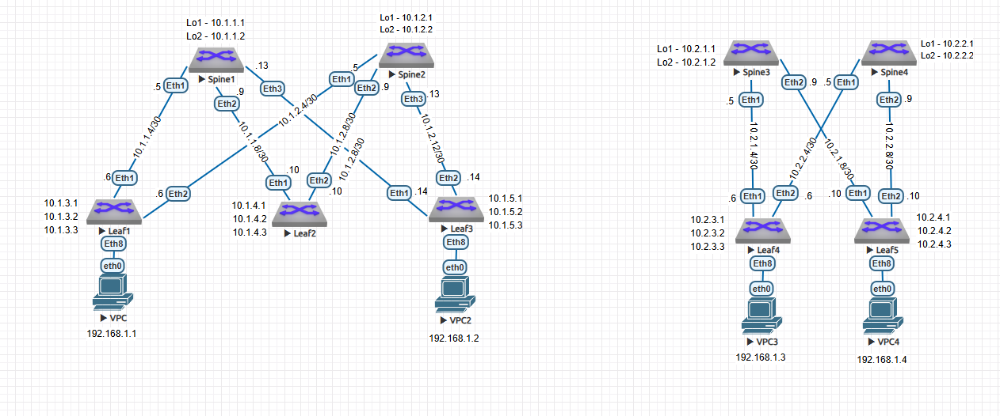
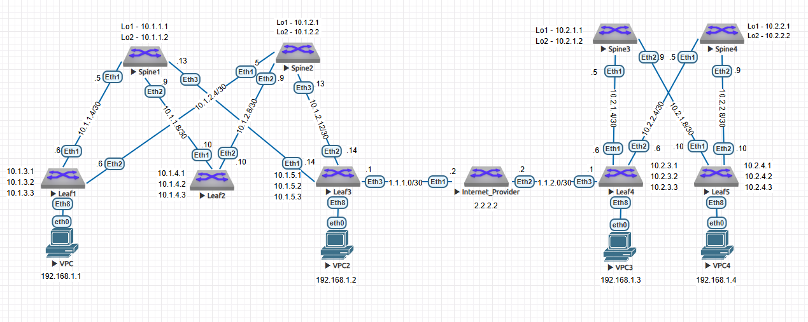

# Проектная работа
## Развертывание 2-го ЦОДа с применением технологии Multisite Vxlan
### План работ:
1. Добавить текущую L3 схему сети
2. Добавить будущую L3 схему сети
3. Добавить таблицу с IP пространством
4. Настроить адресацию нового цода
5. Выбрать и настроить Underlay протокол
6. Настроить Overlay
7. Обеспечить связанность площадок посредством внедрения технологии Multisite Vxlan
8. Проверить доступность сервисов между площадок
9. Оформить презентацию проекта

### 1. Добавить текущую L3 схему сети


### 2. Добавить будущую L3 схему сети

### 3. Таблица с IP пространством
| network ipv4 | Device/port|    Description    |
|--------------|:----------:| -----------------:|
| 10.1.1.1/32  | Spine1/lo1 |     Loopback1     |
| 10.1.1.2/32  | Spine1/lo2 |     Loopback2     |
| 10.1.2.1/32  | Spine2/lo1 |     Loopback1     |
| 10.1.2.2/32  | Spine2/lo2 |     Loopback2     |
| 10.1.3.1/32  |  Leaf1/lo1 |     Loopback1     |
| 10.1.3.2/32  |  Leaf1/lo2 |     Loopback2     |
| 10.1.3.3/32  |  Leaf2/lo3 |     Loopback3     |
| 10.1.4.1/32  |  Leaf2/lo1 |     Loopback1     |
| 10.1.4.2/32  |  Leaf2/lo2 |     Loopback2     |
| 10.1.4.3/32  |  Leaf2/lo3 |     Loopback3     |
| 10.1.5.1/32  |  Leaf3/lo1 |     Loopback1     |
| 10.1.5.2/32  |  Leaf3/lo2 |     Loopback2     |
| 10.1.5.3/32  |  Leaf3/lo3 |     Loopback3     |
| 10.1.1.5/30  | Spine1/Eth1| P2P Link To Leaf1 |
| 10.1.1.9/30  | Spine1/Eth2| P2P Link To Leaf2 |
| 10.1.1.13/30 | Spine1/Eth3| P2P Link To Leaf3 |
| 10.1.1.6/30  | Leaf1/Eth1 | P2P Link To Spine1|
| 10.1.2.6/30  | Leaf1/Eth2 | P2P Link To Spine2|
| 10.1.2.5/30  | Spine2/Eth1| P2P Link To Leaf1 |
| 10.1.2.9/30  | Spine2/Eth2| P2P Link To Leaf2 |
| 10.1.2.13/30 | Spine2/Eth3| P2P Link To Leaf3 |
| 10.1.1.10/30 | Leaf2/Eth1 | P2P Link To Spine1|
| 10.1.2.10/30 | Leaf2/Eth2 | P2P Link To Spine2|
| 10.1.1.14/30 | Leaf3/Eth1 | P2P Link To Spine1|
| 10.1.2.14/30 | Leaf3/Eth2 | P2P Link To Spine2|
| 10.2.1.1/32  | Spine1/lo1 |     Loopback1     |
| 10.2.1.2/32  | Spine1/lo2 |     Loopback2     |
| 10.2.2.1/32  | Spine2/lo1 |     Loopback1     |
| 10.2.2.2/32  | Spine2/lo2 |     Loopback2     |
| 10.2.3.1/32  |  Leaf1/lo1 |     Loopback1     |
| 10.2.3.2/32  |  Leaf1/lo2 |     Loopback2     |
| 10.2.3.3/32  |  Leaf2/lo3 |     Loopback3     |
| 10.2.4.1/32  |  Leaf2/lo1 |     Loopback1     |
| 10.2.4.2/32  |  Leaf2/lo2 |     Loopback2     |
| 10.2.4.3/32  |  Leaf2/lo3 |     Loopback3     |
| 10.2.1.5/30  | Spine1/Eth1| P2P Link To Leaf1 |
| 10.2.1.9/30  | Spine1/Eth2| P2P Link To Leaf2 |
| 10.2.1.6/30  | Leaf1/Eth1 | P2P Link To Spine1|
| 10.2.2.6/30  | Leaf1/Eth2 | P2P Link To Spine2|
| 10.2.2.5/30  | Spine2/Eth1| P2P Link To Leaf1 |
| 10.2.2.9/30  | Spine2/Eth2| P2P Link To Leaf2 |
| 10.2.1.10/30 | Leaf2/Eth1 | P2P Link To Spine1|
| 10.2.2.10/30 | Leaf2/Eth2 | P2P Link To Spine2|
| 10.2.1.1/32  | Spine3/lo1 |     Loopback1     |
| 10.2.1.2/32  | Spine3/lo2 |     Loopback2     |
| 10.2.2.1/32  | Spine4/lo1 |     Loopback1     |
| 10.2.2.2/32  | Spine4/lo2 |     Loopback2     |
| 10.2.3.1/32  |  Leaf4/lo1 |     Loopback1     |
| 10.2.3.2/32  |  Leaf4/lo2 |     Loopback2     |
| 10.2.3.3/32  |  Leaf4/lo3 |     Loopback3     |
| 10.2.4.1/32  |  Leaf5/lo1 |     Loopback1     |
| 10.2.4.2/32  |  Leaf5/lo2 |     Loopback2     |
| 10.2.4.3/32  |  Leaf5/lo3 |     Loopback3     |
| 2.2.2.2/32  |  Provider/lo1 |     Loopback1     |
| 1.1.1.2/32  |  Provider/Eth1 |     P2P Link To Leaf3     |
| 1.1.2.2/32  |  Provider/Eth2 |     P2P Link To Leaf4     |
| 1.1.1.1/32  |  Leaf3/Eth3 |     P2P Link To Provider     |
| 1.1.2.1/32  |  Leaf4/Eth3 |     P2P Link To Provider     |


### 4. Настроить адресацию нового цода

Адресацию выбираем по аналогии с предыдушими работами и по старой формуле
ip = 10.st.splf.x, где:
* st - номер ЦОДа
* sp - номер Spine/Leaf
* x - по порядку

```console
Spine3#conf t
Spine3(config)#interface Ethernet1
Spine3(config-if-Et1)#description P2P_Leaf1_Eth4
Spine3(config-if-Et1)#no sw
Spine3(config-if-Et1)#ip address 10.2.1.5/30 
Spine3(config-if-Et1)#interface Ethernet2
Spine3(config-if-Et2)#description description P2P_Leaf5_Eth1 
Spine3(config-if-Et2)#no sw
Spine3(config-if-Et2)#ip address 10.2.1.9/30 
Spine3(config)#interface Loopback1
Spine3(config-if-Lo1)#description Loopback1
Spine3(config-if-Lo1)#ip address 10.2.1.1/32 
Spine3(config-if-Lo1)#interface Loopback2
Spine3(config-if-Lo2)#description Loobpack2
Spine3(config-if-Lo2)#ip address 10.2.1.2/32 

Spine4#conf t
Spine4(config)#interface Ethernet1
Spine4(config-if-Et1)#description description P2P_Leaf4_Eth2 
Spine4(config-if-Et1)#no sw
Spine4(config-if-Et1)#ip address 10.2.2.5/30 
Spine4(config-if-Et1)#int eth2
Spine4(config-if-Et2)#description description P2P_Leaf5_Eth2 
Spine4(config-if-Et2)#no sw
Spine4(config-if-Et2)#ip address 10.2.2.9/30 
Spine4(config-if-Et2)#int lo1
Spine4(config-if-Lo1)#description Loopback1
Spine4(config-if-Lo1)#ip address 10.2.2.1/32 
Spine4(config-if-Lo1)#interface Loopback2
Spine4(config-if-Lo2)#description Loopback2
Spine4(config-if-Lo2)#ip address 10.2.2.2/32 

Leaf4#conf t
Leaf4(config)#int ethernet 1
Leaf4(config-if-Et1)#description P2P_Spine3_Eth1 
Leaf4(config-if-Et1)#no sw
Leaf4(config-if-Et1)#ip address 10.2.1.6/30 
Leaf4(config-if-Et1)#interface Ethernet2
Leaf4(config-if-Et2)#description P2P_Spine4_Eth1 
Leaf4(config-if-Et2)#no sw
Leaf4(config-if-Et2)#ip address 10.2.2.6/30 
Leaf4(config-if-Et2)#int lo1
Leaf4(config-if-Lo1)#description Loopback1
Leaf4(config-if-Lo1)#ip address 10.2.3.1/32 
Leaf4(config-if-Lo1)#int lo2
Leaf4(config-if-Lo2)#description Loopback2
Leaf4(config-if-Lo2)#ip address 10.2.3.2/32 
Leaf4(config-if-Lo2)#int lo3
Leaf4(config-if-Lo3)#description Vxlan
Leaf4(config-if-Lo3)#ip address 10.2.3.3/32 

Leaf5#conf t
Leaf5(config)#interface Ethernet1
Leaf5(config-if-Et1)#description P2P_Spine3_Eth2 
Leaf5(config-if-Et1)#no sw
Leaf5(config-if-Et1)#ip address 10.2.1.10/30 
Leaf5(config-if-Et1)#int eth2
Leaf5(config-if-Et2)#description P2P_Spine4_ETh2 
Leaf5(config-if-Et2)#no sw
Leaf5(config-if-Et2)#ip address 10.2.2.10/30 
Leaf5(config-if-Et2)#int lo1
Leaf5(config-if-Lo1)#description Loopback1
Leaf5(config-if-Lo1)#ip address 10.2.4.1/32 
Leaf5(config-if-Lo1)#interface Loopback2
Leaf5(config-if-Lo2)#description Loopback2
Leaf5(config-if-Lo2)#ip address 10.2.4.2/32 
Leaf5(config-if-Lo2)#interface Loopback3
Leaf5(config-if-Lo3)#description Vxlan
Leaf5(config-if-Lo3)#ip address 10.2.4.3/32 
```
### 5. Выбрать и настроить Underlay протокол

Также как и прежде для линковочных интерфейсов выберем протокол OSPF

```console
Spine3#conf t
Spine3(config)#ip routing 
Spine3(config)#router ospf 99
Spine3(config-router-ospf)#router-id 10.2.1.1
Spine3(config-router-ospf)#distance ospf intra-area 120
Spine3(config-router-ospf)#passive-interface default
Spine3(config-router-ospf)#no passive-interface Ethernet1
Spine3(config-router-ospf)#no passive-interface Ethernet2
Spine3(config-router-ospf)#no passive-interface Loopback1
Spine3(config-router-ospf)#no passive-interface Loopback2
Spine3(config-router-ospf)#interface Ethernet1
Spine3(config-if-Et1)#ip ospf area 0.0.0.0
Spine3(config-if-Et1)#ip ospf network point-to-point
Spine3(config-if-Et1)#interface Ethernet2
Spine3(config-if-Et2)#ip ospf area 0.0.0.0
Spine3(config-if-Et2)#ip ospf network point-to-point
Spine3(config-if-Et2)#int lo1
Spine3(config-if-Lo1)#ip ospf area 0.0.0.0
Spine3(config-if-Lo1)#int lo2
Spine3(config-if-Lo2)#ip ospf area 0.0.0.0

Spine4#conf t
Spine4(config)#ip routing
Spine4(config)#router ospf 99
Spine4(config-router-ospf)#router-id 10.2.2.1
Spine4(config-router-ospf)#distance ospf intra-area 120
Spine4(config-router-ospf)passive-interface default
Spine4(config-router-ospf)#no passive-interface Ethernet1
Spine4(config-router-ospf)#no passive-interface Ethernet2
Spine4(config-router-ospf)#no passive-interface loopback 1
Spine4(config-router-ospf)#no passive-interface loopback 2
Spine4(config-router-ospf)#interface Ethernet1
Spine4(config-if-Et1)#ip ospf area 0.0.0.0
Spine4(config-if-Et1)#ip ospf network point-to-point
Spine4(config-if-Et1)#interface Ethernet2
Spine4(config-if-Et2)#ip ospf area 0.0.0.0
Spine4(config-if-Et2)#ip ospf network point-to-point
Spine4(config-if-Et2)#int lo1
Spine4(config-if-Lo1)#ip ospf area 0.0.0.0
Spine4(config-if-Lo1)#int lo2
Spine4(config-if-Lo2)#ip ospf area 0.0.0.0

Leaf4#conf t
Leaf4(config)#ip routing
Leaf4(config)#router ospf 99
Leaf4(config-router-ospf)#router-id 10.2.3.1
Leaf4(config-router-ospf)#distance ospf intra-area 120
Leaf4(config-router-ospf)#passive-interface default
Leaf4(config-router-ospf)#no passive-interface Ethernet1
Leaf4(config-router-ospf)#no passive-interface Ethernet2
Leaf4(config-router-ospf)#no passive-interface loopback 1
Leaf4(config-router-ospf)#no passive-interface loopback 2
Leaf4(config-router-ospf)#interface Ethernet1
Leaf4(config-if-Et1)#ip ospf area 0.0.0.0
Leaf4(config-if-Et1)#ip ospf network point-to-point
Leaf4(config-if-Et1)#interface Ethernet2
Leaf4(config-if-Et2)#ip ospf area 0.0.0.0
Leaf4(config-if-Et2)#ip ospf network point-to-point
Leaf4(config-if-Et2)#interface loopback 1
Leaf4(config-if-Lo1)#ip ospf area 0.0.0.0
Leaf4(config-if-Lo1)#interface loopback 2
Leaf4(config-if-Lo2)#ip ospf area 0.0.0.0

Leaf5(config)#ip routing
Leaf5(config)#router ospf 99
Leaf5(config-router-ospf)#router-id 10.2.4.1
Leaf5(config-router-ospf)#distance ospf intra-area 120
Leaf5(config-router-ospf)#passive-interface default
Leaf5(config-router-ospf)#no passive-interface Ethernet1
Leaf5(config-router-ospf)#no passive-interface Ethernet2
Leaf5(config-router-ospf)#no passive-interface loopback 1
Leaf5(config-router-ospf)#no passive-interface loopback 2
Leaf5(config-router-ospf)#interface Ethernet1
Leaf5(config-if-Et1)#ip ospf area 0.0.0.0
Leaf5(config-if-Et1)#ip ospf network point-to-point
Leaf5(config-if-Et1)#interface Ethernet2
Leaf5(config-if-Et2)#ip ospf area 0.0.0.0
Leaf5(config-if-Et2)#ip ospf network point-to-point
Leaf5(config-if-Et2)#interface loopback 1
Leaf5(config-if-Lo1)#ip ospf area 0.0.0.0
Leaf5(config-if-Lo1)#interface loopback 2
Leaf5(config-if-Lo2)#ip ospf area 0.0.0.0
```

Проверим что OSPF заработал

```console
Spine3#sh ip ospf nei
Neighbor ID     Instance VRF      Pri State                  Dead Time   Address         Interface
10.2.3.1        99       default  1   FULL                   00:00:35    10.2.1.6        Ethernet1
10.2.4.1        99       default  1   FULL                   00:00:30    10.2.1.10       Ethernet2

Spine3#sh ip ospf database 

            OSPF Router with ID(10.2.1.1) (Instance ID 99) (VRF default)


                 Router Link States (Area 0.0.0.0)

Link ID         ADV Router      Age         Seq#         Checksum Link count
10.2.2.1        10.2.2.1        93          0x80000007   0xc039   6
10.2.4.1        10.2.4.1        92          0x80000007   0xe706   6
10.2.3.1        10.2.3.1        187         0x80000007   0x9968   6
10.2.1.1        10.2.1.1        100         0x80000007   0xdf22   6
```

### 6. Настроить Overlay

Настроим связанность по BGP

```console
Spine3(config)#router bgp 64534
Spine3(config-router-bgp)#router-id 10.2.1.1
Spine3(config-router-bgp)#neighbor 10.2.3.1 remote-as 64531
Spine3(config-router-bgp)#neighbor 10.2.3.1 update-source Loopback1
Spine3(config-router-bgp)#neighbor 10.2.3.1 ebgp-multihop
Spine3(config-router-bgp)#neighbor 10.2.3.1 send-community extended
Spine3(config-router-bgp)#neighbor 10.2.4.1 remote-as 64532
Spine3(config-router-bgp)#neighbor 10.2.4.1 update-source Loopback1
Spine3(config-router-bgp)#neighbor 10.2.4.1 ebgp-multihop
Spine3(config-router-bgp)#neighbor 10.2.4.1 send-community extended
Spine3(config-router-bgp)#   
Spine3(config-router-bgp)#address-family ipv4
Spine3(config-router-bgp-af)#neighbor 10.2.3.1 activate
Spine3(config-router-bgp-af)#neighbor 10.2.4.1 activate

Spine4(config)#router bgp 64534
Spine4(config-router-bgp)#router-id 10.2.2.1
Spine4(config-router-bgp)#neighbor 10.2.3.1 remote-as 64531
Spine4(config-router-bgp)#neighbor 10.2.3.1 update-source Loopback1
Spine4(config-router-bgp)#neighbor 10.2.3.1 ebgp-multihop
Spine4(config-router-bgp)#neighbor 10.2.3.1 send-community extended
Spine4(config-router-bgp)#neighbor 10.2.4.1 remote-as 64532
Spine4(config-router-bgp)#neighbor 10.2.4.1 update-source Loopback1
Spine4(config-router-bgp)#neighbor 10.2.4.1 ebgp-multihop
Spine4(config-router-bgp)#neighbor 10.2.4.1 send-community extended
Spine4(config-router-bgp)#address-family ipv4
Spine4(config-router-bgp-af)#neighbor 10.2.3.1 activate
Spine4(config-router-bgp-af)#neighbor 10.2.4.1 activate

Leaf4(config)#router bgp 64531
Leaf4(config-router-bgp)#router-id 10.2.3.1
Leaf4(config-router-bgp)#neighbor 10.2.1.1 remote-as 64534
Leaf4(config-router-bgp)#neighbor 10.2.1.1 update-source Loopback1
Leaf4(config-router-bgp)#neighbor 10.2.1.1 ebgp-multihop
Leaf4(config-router-bgp)#neighbor 10.2.1.1 send-community extended
Leaf4(config-router-bgp)#neighbor 10.2.2.1 remote-as 64534
Leaf4(config-router-bgp)#neighbor 10.2.2.1 update-source Loopback1
Leaf4(config-router-bgp)#neighbor 10.2.2.1 ebgp-multihop
Leaf4(config-router-bgp)#neighbor 10.2.2.1 send-community extended
Leaf4(config-router-bgp)#address-family ipv4
Leaf4(config-router-bgp-af)#neighbor 10.2.1.1 activate
Leaf4(config-router-bgp-af)#neighbor 10.2.2.1 activate
Leaf4(config-router-bgp-af)#network 10.2.3.2/32
Leaf4(config-router-bgp-af)#network 10.2.3.3/32

Leaf5(config)#router bgp 64532
Leaf5(config-router-bgp)#router-id 10.2.4.1
Leaf5(config-router-bgp)#neighbor 10.2.1.1 remote-as 64534
Leaf5(config-router-bgp)#neighbor 10.2.1.1 update-source Loopback1
Leaf5(config-router-bgp)#neighbor 10.2.1.1 ebgp-multihop
Leaf5(config-router-bgp)#neighbor 10.2.1.1 send-community extended
Leaf5(config-router-bgp)#neighbor 10.2.2.1 remote-as 64534
Leaf5(config-router-bgp)#neighbor 10.2.2.1 update-source Loopback1
Leaf5(config-router-bgp)#neighbor 10.2.2.1 ebgp-multihop
Leaf5(config-router-bgp)#neighbor 10.2.2.1 send-community extended
Leaf5(config-router-bgp)#address-family ipv4
Leaf5(config-router-bgp-af)#neighbor 10.2.1.1 activate
Leaf5(config-router-bgp-af)#neighbor 10.2.2.1 activate
Leaf5(config-router-bgp-af)#network 10.2.4.2/32
Leaf5(config-router-bgp-af)#network 10.2.4.3/32
```

Проверим что BGP заработало

```console
Spine3#sh ip bgp summary
BGP summary information for VRF default
Router identifier 10.2.1.1, local AS number 64534
Neighbor Status Codes: m - Under maintenance
  Neighbor V AS           MsgRcvd   MsgSent  InQ OutQ  Up/Down State   PfxRcd PfxAcc
  10.2.3.1 4 64531             25        32    0    0 00:02:41 Estab   2      2
  10.2.4.1 4 64532             22        33    0    0 00:02:41 Estab   2      2
```

Настроим Vxlan и поднимим EVPN

```console
Leaf4(config)#ip routing vrf GLOBAL
Leaf4(config)#vrf instance GLOBAL
Leaf4(config-vrf-GLOBAL)#exit
Leaf4(config)#vlan 100
Leaf4(config-vlan-100)#   name PC
Leaf4(config-vlan-100)#exit
Leaf4(config)#interface Vxlan1
Leaf4(config-if-Vx1)#vxlan source-interface Loopback3
Leaf4(config-if-Vx1)#vxlan udp-port 4789
Leaf4(config-if-Vx1)#vxlan vlan 100 vni 100100
Leaf4(config-if-Vx1)#vxlan vrf GLOBAL vni 100001
Leaf4(config-if-Vx1)#exit
Leaf4(config)#router bgp 64531
Leaf4(config-router-bgp)#vlan 100
Leaf4(config-macvrf-100)#rd 64531:100100
Leaf4(config-macvrf-100)#route-target both 65531:100100
Leaf4(config-macvrf-100)#redistribute learned
Leaf4(config-macvrf-100)#exit
Leaf4(config-router-bgp)#address-family evpn
Leaf4(config-router-bgp-af)#neighbor 10.2.1.1 activate
Leaf4(config-router-bgp-af)#neighbor 10.2.2.1 activate
Leaf4(config-router-bgp-af)#exit
Leaf4(config-router-bgp)#vrf GLOBAL
Leaf4(config-router-bgp-vrf-GLOBAL)#rd 64531:100001
Leaf4(config-router-bgp-vrf-GLOBAL)#route-target import evpn 1:100001
Leaf4(config-router-bgp-vrf-GLOBAL)#route-target export evpn 1:100001
Leaf4(config-router-bgp-vrf-GLOBAL)#redistribute connected

Leaf5(config)#ip routing vrf GLOBAL
Leaf5(config-vrf-GLOBAL)#exit
Leaf5(config)#vlan 100
Leaf5(config-vlan-100)#name PC
Leaf5(config-vlan-100)#exit
Leaf5(config)#interface Vxlan1
Leaf5(config-if-Vx1)#vxlan source-interface Loopback3
Leaf5(config-if-Vx1)#vxlan udp-port 4789
Leaf5(config-if-Vx1)#vxlan vlan 100 vni 100100
Leaf5(config-if-Vx1)#vxlan vrf GLOBAL vni 100001
Leaf5(config-if-Vx1)#exit
Leaf5(config)#router bgp 64532
Leaf5(config-router-bgp)#vlan 100
Leaf5(config-macvrf-100)#rd 64532:100100
Leaf5(config-macvrf-100)#route-target both 65531:100100
Leaf5(config-macvrf-100)#redistribute learned
Leaf5(config-macvrf-100)#exit
Leaf5(config-router-bgp)#address-family evpn
Leaf5(config-router-bgp-af)#neighbor 10.2.1.1 activate
Leaf5(config-router-bgp-af)#neighbor 10.2.2.1 activate
Leaf5(config-router-bgp-af)#exit
Leaf5(config-router-bgp)#vrf GLOBAL
Leaf5(config-router-bgp-vrf-GLOBAL)#rd 64532:100001
Leaf5(config-router-bgp-vrf-GLOBAL)#route-target import evpn 1:100001
Leaf5(config-router-bgp-vrf-GLOBAL)#Lroute-target export evpn 1:100001
Leaf5(config-router-bgp-vrf-GLOBAL)#redistribute connected


Spine3(config)#router bgp 64534
Spine3(config-router-bgp)#address-family evpn
Spine3(config-router-bgp-af)#neighbor 10.2.3.1 activate
Spine3(config-router-bgp-af)#neighbor 10.2.4.1 activate

Spine4(config)#router bgp 64534
Spine4(config-router-bgp)#address-family evpn
Spine4(config-router-bgp-af)#neighbor 10.2.3.1 activate
Spine4(config-router-bgp-af)#neighbor 10.2.4.1 activate
```
Убедимся что VTEP есть

```console
Leaf4#sh vxlan vtep 
Remote VTEPS for Vxlan1:

VTEP           Tunnel Type(s)
-------------- --------------
10.2.4.3       unicast, flood

Total number of remote VTEPS:  1
```

настроим порты в сторону хостов

Leaf4(config)#int eth8
Leaf4(config-if-Et8)#sw
Leaf4(config-if-Et8)#sw mode acc
Leaf4(config-if-Et8)#sw acc v 100

Leaf5(config)#int eth8
Leaf5(config-if-Et8)#sw
Leaf5(config-if-Et8)#sw mode acc
Leaf5(config-if-Et8)#sw acc v 100

Убедимся что машины пингуют друг друга и проверим EVPN маршруты

```console
PC4> ping 192.168.1.3

84 bytes from 192.168.1.3 icmp_seq=1 ttl=64 time=102.882 ms
84 bytes from 192.168.1.3 icmp_seq=2 ttl=64 time=52.451 ms
84 bytes from 192.168.1.3 icmp_seq=3 ttl=64 time=46.436 ms
84 bytes from 192.168.1.3 icmp_seq=4 ttl=64 time=52.444 ms
84 bytes from 192.168.1.3 icmp_seq=5 ttl=64 time=58.416 ms
```

```console
Leaf4#sh bgp evpn route-type mac-ip 
BGP routing table information for VRF default
Router identifier 10.2.3.1, local AS number 64531
Route status codes: * - valid, > - active, S - Stale, E - ECMP head, e - ECMP
                    c - Contributing to ECMP, % - Pending BGP convergence
Origin codes: i - IGP, e - EGP, ? - incomplete
AS Path Attributes: Or-ID - Originator ID, C-LST - Cluster List, LL Nexthop - Link Local Nexthop

          Network                Next Hop              Metric  LocPref Weight  Path
 * >      RD: 64531:100100 mac-ip 0050.7966.680c
                                 -                     -       -       0       i
 * >Ec    RD: 64532:100100 mac-ip 0050.7966.680d
                                 10.2.4.3              -       100     0       64534 64532 i
 *  ec    RD: 64532:100100 mac-ip 0050.7966.680d
                                 10.2.4.3              -       100     0       64534 64532 i
 * >Ec    RD: 64532:100100 mac-ip 5000.00cb.38c2
                                 10.2.4.3              -       100     0       64534 64532 i
 *  ec    RD: 64532:100100 mac-ip 5000.00cb.38c2
                                 10.2.4.3              -       100     0       64534 64532 i
 * >      RD: 64531:100100 mac-ip 5000.00d7.ee0b
                                 -                     -       -       0       i
```

### 7. Обеспечить связанность площадок посредством внедрения технологии Multisite Vxlan

Добавим новое устройство в кач. интернет провайдера и настроим адресацию на портах/лупбеках

```console
Leaf3(config)#int ethernet 3
Leaf3(config-if-Et3)#description == To_DC2 ==
Leaf3(config-if-Et3)#no sw
Leaf3(config-if-Et3)#ip address 1.1.1.1 255.255.255.252

Leaf4(config)#int eth3
Leaf4(config-if-Et3)#description == To_DC1 ==
Leaf4(config-if-Et3)#no sw
Leaf4(config-if-Et3)#ip address 1.1.2.1 255.255.255.252

Provider(config)#int ethernet 1
Provider(config-if-Et1)#description == To_DC1 ==
Provider(config-if-Et1)#no sw
Provider(config-if-Et1)#ip add 1.1.1.2 255.255.255.252
Provider(config-if-Et1)#int eth2
Provider(config-if-Et2)#description == To_DC2 ==
Provider(config-if-Et2)#no sw
Provider(config-if-Et2)#ip add 1.1.2.2 255.255.255.252
Provider(config-if-Et2)#int lo1
Provider(config-if-Lo1)#ip add 2.2.2.2 255.255.255.255
```

Настроим BGP связанность между бордер лифами и провайдером

```console
Provider(config)#router bgp 63535
Provider(config-router-bgp)#neighbor 1.1.1.1 remote-as 65533
Provider(config-router-bgp)#neighbor 1.1.1.1 update-source Ethernet1
Provider(config-router-bgp)#neighbor 1.1.1.1 send-community extended 
Provider(config-router-bgp)#neighbor 1.1.2.1 remote-as 64531
Provider(config-router-bgp)#neighbor 1.1.2.1 update-source Ethernet2
Provider(config-router-bgp)#neighbor 1.1.2.1 send-community extended 

Leaf3(config)#router bgp 65533
Leaf3(config-router-bgp)#neighbor 1.1.1.2 remote-as 63535
Leaf3(config-router-bgp)#neighbor 1.1.1.2 update-source Ethernet3
Leaf3(config-router-bgp)#nei 1.1.1.2 send-community extended 

Leaf4(config)#router bgp 64531
Leaf4(config-router-bgp)#neighbor 1.1.2.2 remote-as 63535
Leaf4(config-router-bgp)#neighbor 1.1.2.2 update-source ethernet 3
Leaf4(config-router-bgp)#neighbor 1.1.2.2 send-community extended 
```

Проверим что BGP сессия поднялась

```console
Provider#sh ip bgp summary 
BGP summary information for VRF default
Router identifier 2.2.2.2, local AS number 63535
Neighbor Status Codes: m - Under maintenance
  Neighbor         V  AS           MsgRcvd   MsgSent  InQ OutQ  Up/Down State   PfxRcd PfxAcc
  1.1.1.1          4  65533             13        12    0    0 00:00:30 Estab   6      6
  1.1.2.1          4  64531             12        13    0    0 00:00:05 Estab   4      4
```

```console
Leaf3#sh ip bgp 
BGP routing table information for VRF default
Router identifier 10.1.5.1, local AS number 65533
Route status codes: s - suppressed contributor, * - valid, > - active, E - ECMP head, e - ECMP
                    S - Stale, c - Contributing to ECMP, b - backup, L - labeled-unicast
                    % - Pending BGP convergence
Origin codes: i - IGP, e - EGP, ? - incomplete
RPKI Origin Validation codes: V - valid, I - invalid, U - unknown
AS Path Attributes: Or-ID - Originator ID, C-LST - Cluster List, LL Nexthop - Link Local Nexthop

          Network                Next Hop              Metric  AIGP       LocPref Weight  Path
 * >      10.1.3.2/32            10.1.1.1              0       -          100     0       65534 65531 i
 *        10.1.3.2/32            10.1.2.1              0       -          100     0       65534 65531 i
 * >      10.1.3.3/32            10.1.1.1              0       -          100     0       65534 65531 i
 *        10.1.3.3/32            10.1.2.1              0       -          100     0       65534 65531 i
 * >      10.1.4.2/32            10.1.1.1              0       -          100     0       65534 65532 i
 *        10.1.4.2/32            10.1.2.1              0       -          100     0       65534 65532 i
 * >      10.1.4.3/32            10.1.1.1              0       -          100     0       65534 65532 i
 *        10.1.4.3/32            10.1.2.1              0       -          100     0       65534 65532 i
 * >      10.1.5.2/32            -                     -       -          -       0       i
 * >      10.1.5.3/32            -                     -       -          -       0       i
 * >      10.2.3.2/32            1.1.1.2               0       -          100     0       63535 64531 i
 * >      10.2.3.3/32            1.1.1.2               0       -          100     0       63535 64531 i
 * >      10.2.4.2/32            1.1.1.2               0       -          100     0       63535 64531 64534 64532 i
 * >      10.2.4.3/32            1.1.1.2               0       -          100     0       63535 64531 64534 64532 i
```

Попробуем теперь настроить EVPN между бордерлифами

```console
Leaf4(config)#router bgp 64531
Leaf4(config-router-bgp)#no neighbor 10.1.5.1
Leaf4(config-router-bgp)#neighbor 10.1.5.3 remote-as 65533
Leaf4(config-router-bgp)#neighbor 10.1.5.3 update-source Loopback3
Leaf4(config-router-bgp)#neighbor 10.1.5.3 ebgp-multihop
Leaf4(config-router-bgp)#neighbor 10.1.5.3 send-community extended

Leaf3(config)#router bgp 65533
Leaf3(config-router-bgp)#neighbor 10.2.3.3 remote-as 64531
Leaf3(config-router-bgp)#neighbor 10.2.3.3 update-source Loopback3
Leaf3(config-router-bgp)#neighbor 10.2.3.3 ebgp-multihop
Leaf3(config-router-bgp)#neighbor 10.2.3.3 send-community extended

Leaf4(config)#router bgp 64531
Leaf4(config-router-bgp)#  address-family evpn
Leaf4(config-router-bgp-af)#neighbor 10.1.5.3 activate

Leaf3(config)#router bgp 65533
Leaf3(config-router-bgp)#address-family evpn
Leaf3(config-router-bgp-af)#neighbor 10.2.3.3 activate 
```

Странно, что в соседстве мы увидели все VTEP а не только бордер лифа

```console
Leaf3#sh vxlan vtep
Remote VTEPS for Vxlan1:

VTEP           Tunnel Type(s)
-------------- --------------
10.1.3.3       flood, unicast
10.1.4.3       flood, unicast
10.2.3.3       flood, unicast
10.2.4.3       flood, unicast

Total number of remote VTEPS:  4
```

Надо указать Remote domain

```console
Leaf4(config-router-bgp-af)#neighbor 10.1.5.3 domain remote

Leaf3(config-router-bgp-af)#neighbor 10.2.3.3 domain remote 
```

После указания этой комманды вообще всё разъехалось и мы не видим удаленного VTEP в другом DC. Попробуем теперь выбрать и сконфигурировать сети которые мы хотим отдавать удаленному EVPN домену.
Делать это будем на бордер лифах

```console
Leaf3#conf t
Leaf3(config)#router bgp 65533
Leaf3(config-router-bgp)#vlan 100
Leaf3(config-macvrf-100)#rd evpn domain all 65533:100100
Leaf3(config-macvrf-100)# route-target import export evpn domain all 65531:100100

Leaf4#conf t
Leaf4(config)#router bgp 64531
Leaf4(config-router-bgp)#vlan 100
Leaf4(config-macvrf-100)#rd evpn domain all 64531:100100
Leaf4(config-macvrf-100)#route-target import export evpn domain all 65531:100100 
```
### 8. Проверить доступность сервисов между площадок
Попробуем пингануть хост в DC1 из DC2

```console
PC4> ping 192.168.1.1

192.168.1.1 icmp_seq=1 timeout
192.168.1.1 icmp_seq=2 timeout
84 bytes from 192.168.1.1 icmp_seq=3 ttl=64 time=345.527 ms
84 bytes from 192.168.1.1 icmp_seq=4 ttl=64 time=642.471 ms
84 bytes from 192.168.1.1 icmp_seq=5 ttl=64 time=358.670 ms
```

Видимо что пинг пошёл и VTEP поднялся только между бордерлифами

```console
Leaf3#sh vxlan vtep det
Remote VTEPS for Vxlan1:

VTEP       Learned Via     MAC Address Learning   EVPN Domain    Tunnel Type(s)
---------- --------------- ---------------------- -------------- --------------
10.1.3.3   control plane   control plane          local          flood, unicast
10.1.4.3   control plane   control plane          local          flood, unicast
10.2.3.3   control plane   control plane          remote         flood, unicast
```

Теперь посмотрим маршруты BGP EVPN на leaf1, который играет роль обычного Leaf. Маршруты к компу в другом DC должны вести нас на BGW.

```console
Leaf1#sh bgp evpn
BGP routing table information for VRF default
Router identifier 10.1.3.1, local AS number 65531
Route status codes: * - valid, > - active, S - Stale, E - ECMP head, e - ECMP
                    c - Contributing to ECMP, % - Pending BGP convergence
Origin codes: i - IGP, e - EGP, ? - incomplete
AS Path Attributes: Or-ID - Originator ID, C-LST - Cluster List, LL Nexthop - Link Local Nexthop

          Network                Next Hop              Metric  LocPref Weight  Path
 * >      RD: 65531:100100 mac-ip 0050.7966.6806
                                 -                     -       -       0       i
 * >      RD: 65531:100100 mac-ip 0050.7966.6806 192.168.1.1
                                 -                     -       -       0       i
 * >Ec    RD: 65533:100100 mac-ip 0050.7966.680d
                                 10.1.5.3              -       100     0       65534 65533 64531 64534 64532 i
 *  ec    RD: 65533:100100 mac-ip 0050.7966.680d
                                 10.1.5.3              -       100     0       65534 65533 64531 64534 64532 i
 * >Ec    RD: 65533:100100 mac-ip 5000.00cb.38c2
                                 10.1.5.3              -       100     0       65534 65533 64531 64534 64532 i
 *  ec    RD: 65533:100100 mac-ip 5000.00cb.38c2
                                 10.1.5.3              -       100     0       65534 65533 64531 64534 64532 i
 * >Ec    RD: 65533:100100 mac-ip 5000.00d7.ee0b
                                 10.1.5.3              -       100     0       65534 65533 64531 i
 *  ec    RD: 65533:100100 mac-ip 5000.00d7.ee0b
                                 10.1.5.3              -       100     0       65534 65533 64531 i
 * >      RD: 65531:100100 imet 10.1.3.3
                                 -                     -       -       0       i
 * >      RD: 65531:100300 imet 10.1.3.3
                                 -                     -       -       0       i
 * >Ec    RD: 65532:100300 imet 10.1.4.3
                                 10.1.4.3              -       100     0       65534 65532 i
 *  ec    RD: 65532:100300 imet 10.1.4.3
                                 10.1.4.3              -       100     0       65534 65532 i
 * >Ec    RD: 65533:100100 imet 10.1.5.3
                                 10.1.5.3              -       100     0       65534 65533 i
 *  ec    RD: 65533:100100 imet 10.1.5.3
                                 10.1.5.3              -       100     0       65534 65533 i
 * >Ec    RD: 65533:100300 imet 10.1.5.3
                                 10.1.5.3              -       100     0       65534 65533 i
 *  ec    RD: 65533:100300 imet 10.1.5.3
                                 10.1.5.3              -       100     0       65534 65533 i
 * >      RD: 65533:100001 ip-prefix 10.10.10.0/29
                                 10.1.5.3              -       100     0       65534 65533 i
 *        RD: 65533:100001 ip-prefix 10.10.10.0/29
                                 10.1.5.3              -       100     0       65534 65533 i
 * >      RD: 65533:100002 ip-prefix 172.16.1.0/29
                                 10.1.5.3              -       100     0       65534 65533 i
 *        RD: 65533:100002 ip-prefix 172.16.1.0/29
                                 10.1.5.3              -       100     0       65534 65533 i
 * >      RD: 65531:100001 ip-prefix 192.168.1.0/24
                                 -                     -       -       0       i
 * >      RD: 65533:100001 ip-prefix 192.168.1.0/24
                                 10.1.5.3              -       100     0       65534 65533 i
 *        RD: 65533:100001 ip-prefix 192.168.1.0/24
                                 10.1.5.3              -       100     0       65534 65533 i
 * >      RD: 65532:100001 ip-prefix 192.168.2.0/24
                                 10.1.4.3              -       100     0       65534 65532 i
 *        RD: 65532:100001 ip-prefix 192.168.2.0/24
                                 10.1.4.3              -       100     0       65534 65532 i
 * >      RD: 65532:100002 ip-prefix 192.168.3.0/24
                                 10.1.4.3              -       100     0       65534 65532 i
 *        RD: 65532:100002 ip-prefix 192.168.3.0/24
                                 10.1.4.3              -       100     0       65534 65532 i
 * >      RD: 65533:100002 ip-prefix 192.168.3.0/24
                                 10.1.5.3              -       100     0       65534 65533 i
 *        RD: 65533:100002 ip-prefix 192.168.3.0/24
                                 10.1.5.3              -       100     0       65534 65533 i
```

Видим что мак 0050.7966.680d виден на 10.1.5.3.  
Успех.
